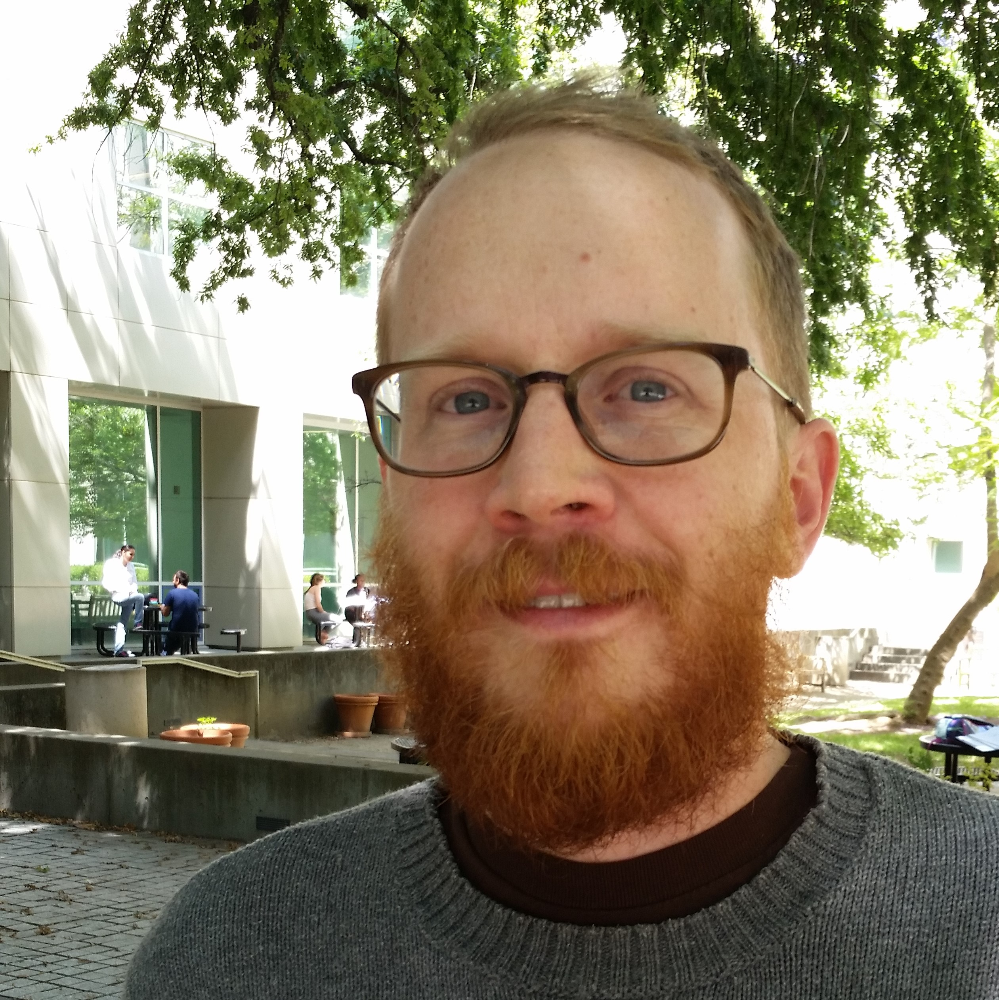
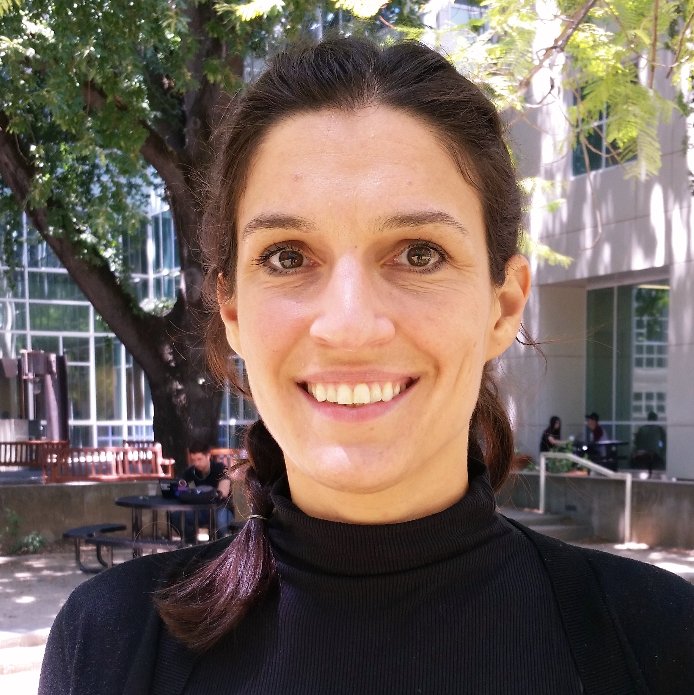
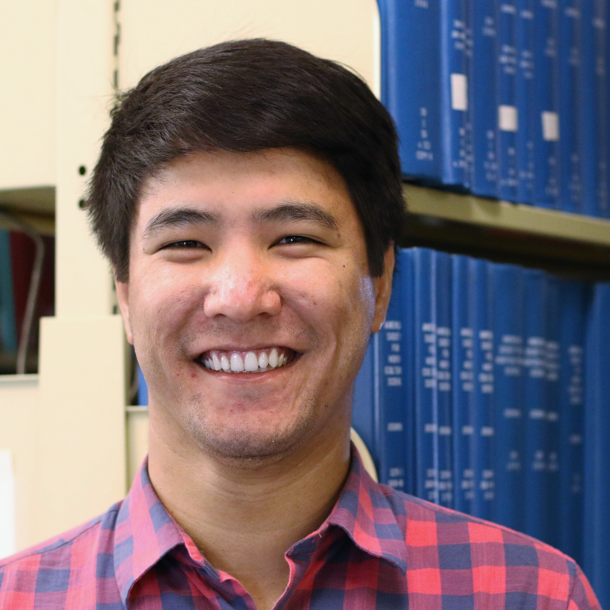
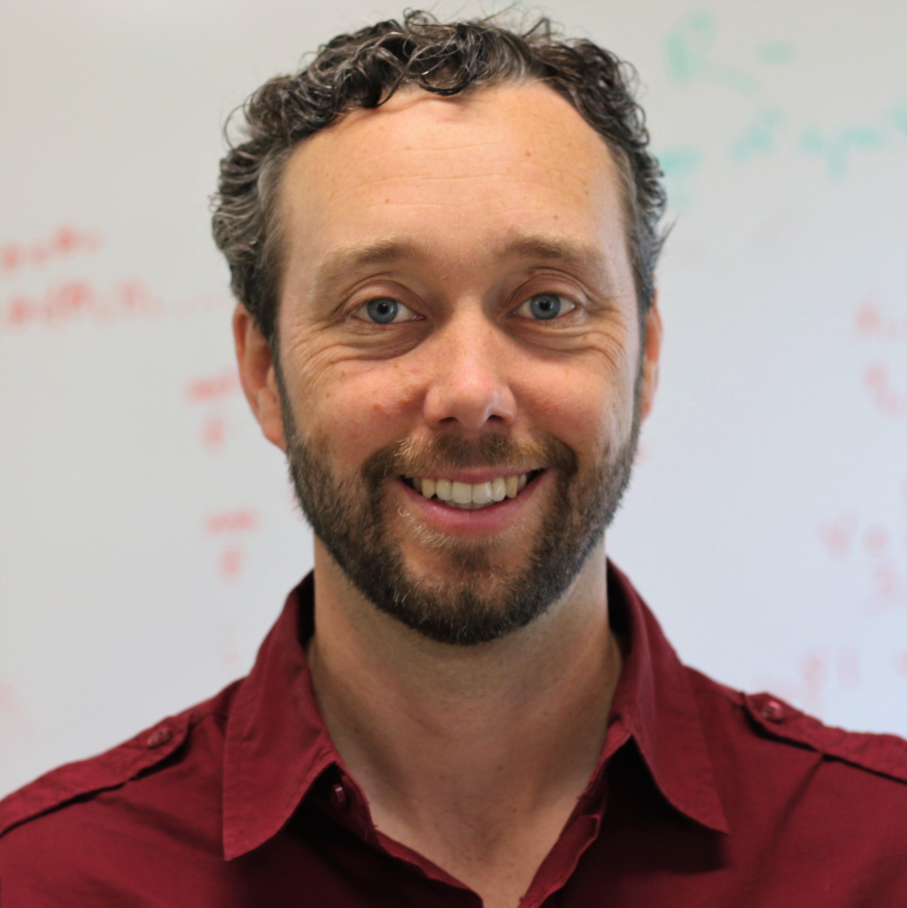

Title: Affiliates
Authors: DSI

# Graduate Student & Postdoctoral Affiliates

Graduate students and postdoctoral scholars from departments and groups across
UC Davis engage, learn and work in the DSI. Interested in becoming a DSI affiliate? See our [membership page](http://www.dsi.ucdavis.edu/About/Membership/) to apply.

## Postdocs 

**[Jamie Ashander](http://www.ashander.info)** (mailto:jashander@ucdavis.edu) 
    Visiting postdoc, UCLA. *Evolution and ecology of population dynamics under environmental change.* Jamie is interested in how demography and evolutionary change affect traits and plastic responses of wild populations. Jamie blends theoretical modeling with computation, and develops software to confront theoretical models with heterogeneous data (e.g., trajectories of population abundance and trait values, diversity statistics calculated from genomic data). For his postdoctoral work he is developing methodology for using genomic data to inform demographic models of the desert tortoise to predict the effects development in the Mojave desert on its population viability. Jamie uses R for visualization, and python and C++ for simulations and statistical methods. Jamie is a Software Carpentry instructor. Jamie seeks to share his knowledge and learn about new tools and approaches, especially data engineering and the use of functional programming paradigms in data science.

**[Teresa Filshtein](http://www.ucdmc.ucdavis.edu/alzheimers/)** (mailto:tjfilshtein@ucdavis.edu) 
    UC Davis Medical Center. *Biostatistics and multi-response longitudinal data.* Teresa is a postdoc at the UC Davis Medical Center and works on problems related to Alzheimer's Disease and Dementia. For her postdoc she is using current data science techniques to advance the field of Alzheimer's Disease research. Teresa is pursuing advanced skills in web analytics, text mining, and python, and to gain more exposure to real life data problems and see how they are tackled from the ground up. 

## Graduate Students

**[Zamirbek Akimbekov](https://akimbekov.com)** (mailto: zakimbekov@ucdavis.edu)
    Statistics. *Statistical and thermodynamic analysis of computationally predicted structures.* Zamir teaches machines to learn. He is interested in the application of machine learning and statistics in pattern recognition, anomaly detection, and prediction. He wants to engage in collaborative data science projects with people from different backgrounds to experiment and learn new data science technologies.

**[Matthew Bates](https://www.linkedin.com/in/mebates)** (mailto: Mebates@ucdavis.edu)
    Civil and Environmental Engineering. *Decision making under uncertainty.* Matt has a background in computer science, software development, and water resources engineering. He is interested in methods of risk and decision in science, simulation and optimization. He is interested in the broad, data science workflow from ideation and requirements development to results visitation and dissemination. His current research includes data analysis related to engineered infrastructure. Matt wants to learn more about multivariate regression, machine learning, web scraping, and semantic analysis, and improve his expertise in Python and R.

**[Cory Belden](http://coryrbelden.weebly.com/)** (mailto: crbelden@ucdavis.edu)
    Political Science. * How political institutions affect elected representatives and policy outcomes for the environment.* Cory studies how political institutions influence the behavior of elected representatives (i.e., legislators, executives), and how differences in behavior affect policy outcomes related to climate change and the environment. She uses web-scraping, content analysis, and natural language processing (NLP) to obtain and analyze legislative speeches and spatial data to study behaviors across countries (including the United States, Australia, Chile, the UK, and New Zealand). Cory primarily uses R along with spatial methods to overlay political boundaries with relevant measures of "policy problems," such as the severity of drought. Cory is further developing her spatial and text mining skills. 

**[Michael Bissel](http://www.vetmed.ucdavis.edu/gge/index.cfm)** (mailto: mcbissell@ucdavis.edu)
  Epidemiology. *Predicting breast cancer risk with machine learning.* Michael has a background in statistics and applied mathematics. His research focuses on applying machine learning methods to improve predictions of breast cancer risk in unique populations. He would like to learn more about applying KNN, Random Forest, SVM, and other techniques to survival data.

**[Nicholas Bowden](http://engineering.ucdavis.edu/ttp/)** (mailto: nsbowden@ucdavis.edu), graduate
	  student in Transportation Technology and Policy. *Economic environmental policy of energy and transportation.* Nick's background is in theoretical economics and econometrics. His research focuses on the electrification of transportation and carbon policy. He uses high frequency time series data collection and modeling of electric power and transportation systems. Nick is interested in learning programming skills for more efficient methods of compiling data from public and regulated entities. Because these data relate to stationary power sources for the use of stationary transportation networks, he is also interested in visualization of this data onto relevant geographic planes.  

**[Katherine Corn](http://katherinecorn.wordpress.com)** (mailto:kacorn@ucdavis.edu), graduate
student in 
Population Biology. *Form, function and diversity of fishes.* Katherine is a macro-evolutionary biologist. She uses fish phylogenies for comparative analyses and is pursuing integrating mechanical models with kinematic data from high speed videos. She want to learn how to work effectively, efficiently and cleanly with large, messy phylogenetic and kinematic datasets.

**[Clark Fitzgerald](https://www.stat.ucdavis.edu/)** (mailto:rcfitzgerald@ucdavis.edu), graduate
student in Statistics. 
*Computational technologies that enable data science at scale.* Clark is working on improving R through parallel computing. He'd like to learn about interesting applications and related data sets.

**[Shaun Geer](http://sociology.ucdavis.edu/people/scgeer)** (mailto:scgeer@ucdavis.edu), graduate student in Sociology
*The science of conducting science*
Shaun's research uses large datasets to examine how we do research in science and medicine.	
He has experience with web crawling/scraping and computational linguistics.
Shaun wants to learn more about Bayesian statistical techniques (e.g., MCMC).

**[Adam Getchell](https://keybase.io/adamgetchell)** (mailto:acgetchell@ucdavis.edu), graduate student in Physics
*Quantum gravity using computational models*
Adam has a general background in information technology and programming experience (C++, Python, C#, Lisp, Clojure, and F#, among others). Adam has experience with running MCMC (Monte Carlo Markov Chain) and related methods.
Adam wants to learn R and more statistics, data science methods, and anything else related to collating/analyzing large data sets.

**[Ehsan Gholami](http://www.ece.ucdavis.edu/)** (mailto: egholami@ucdavis.edu), graduate student in Electrical and Computer Engineering
*Online social media user behavior and purchasing patterns*
Ehsan is using business datasets combined with online social media information to predict user attributes based on user behavior.
Ehsan is interested in collaborating with colleagues from various departments to learn relevant information, techniques and tools that others find useful.

**[Danielle Hagood](http://education.ucdavis.edu/dhagood)** (mailto: dhagood@ucdavis.edu), graduate student in Education
*Noncognitive constructs in K12 settings using computational psychometrics*
Danielle's research draws on intensive, multi-modal data to produce learning analytics offering individual-level insights and, in aggregate, informs teaching and policy. Her practice-embedded research foregrounds the needs of teachers and students, with a critical SES perspective. She uses data science approaches to structure messy data and creatively identify data sources.
Danielle wants to learn more advanced programming for data in R and Python, and to engage in collaborative reading and working groups on applied machine learning.

**[Luiz Carlos Irber, Júnior](http://luizirber.org)** (mailto: lcirberjr@ucdavis.edu), graduate student in Computer Science
*Genomic sequencing data, decentralized data sharing, computational skills*
Luiz is developing methods for biological data analysis in Python and C++ using Jupyter notebooks; pipelines with Spark, Dask and snakemake; and data distribution using IPFS and dat.
Luiz wants to collaborate with researchers from other areas to find common methods and share experiences.

**[Jared Joseph](http://sociology.ucdavis.edu/people/jnjoseph)** (mailto:jnjoseph@ucdavis.edu), graudate student in Sociology
*Surveillance and crime using social network analysis and statistical analysis in R*
Jared has prior experience with SPSS and Stata, and is interested in big data, network data, and online environments (social networking sites, MMOs, online forums).

**[Eric Kalosa-Kenyon](ekalosak.github.io)** (mailto: ekal@ucdavis.edu), graduate student in Statistics
*Application-driven statistical and computational methodology*
Prior to grad school Eric worked as a Computational Research Associate in the Data Science group at Indigo Agriculture. 
His research is in mathematical statistics. Eric is especially interested in collaborating with domain scientists on pragmatic projects in pursuit of the University's mission to improve the quality of life for everyone.

**[Melissa Kardish](melissakardish.wordpress.com)** (mailto: mrkardish@ucdavis.edu), graduate student in Population Biology
*Microbial ecology of seagrass communities*
Melissa has worked with terrestrial plants, ants, birds, and fungi, and now works with the plants, animals and microbes in the sea. 
She is broadly interested in patterns of species diversity and how different communities of microbes have different effects on seagrass and seagrass-associated communities.
Melissa works with data describing microbial communities. She primarily uses R, but also with other languages to process and analyze sequencing data.
Melissa credits her experience at the DSI with helping her to learn cleaner and more efficient workflows. She hope to learn new skills that she can apply later when facing problems in collaborations or in her own research.

**[Ranjodh Singh Dhaliwal](http://english.ucdavis.edu/people/ranjodh)** (mailto: rjdhaliwal@ucdavis.edu), graduate student in English
*Quantitative digital humanities*
Ranjodh has a background in computer science and is interested in contemporary literature, art, videogame studies, science and technology studies, and new media theory. He uses topic modeling and Neural Networks for his natural language processing research. 
He wants to explore the intersections between NLP and machine learning, and exploring theory in data science.

**[Scott Devine](https://casoilresource.lawr.ucdavis.edu/)** (mailto: smdevine@ucdavis.edu), graduate student in Soils and Biogeochemistry
*Natural resources database to address society, agriculture and the environment*
Scott works in the Department of Land, Air, and Water resources. He has international, hands-on, scientific, and management experience in agriculture, combined with a passion and curiosity for seeking sustainable solutions to challenging problems.	
He uses R to work with the Soil Survey Geographic Database (SSURGO), the most complete natural resources database in the United States. He is merging SSURGO with other geographic data to answer questions of broad relevance to society, agriculture, and the environment.
Scott wants to learn advanced programming and the skills to work with challenging and complex data sets, many of which have spatial and temporal dimensions.  

**[Nicholas Ellinwood](http://www.ucdmc.ucdavis.edu/pharmacology/)** (mailto: nellinwood@ucdavis.edu), graduate student in Pharmacology and Toxicology
* Identifying optimal drug characteristics to improve pharmacological options to prevent heart attacks*
Nick's research involves using computational approaches to reveal the cellular and molecular mechanisms of cardiac arrhythmias. 
He is working to apply in vivo and in silico data related to healthy and diseased cardiac function to the clinical setting.

** [Zachary Harmany](http://drz.ac/)** (mailto: ztharmany@ucdavis.edu), project scientist in Biomedical Engineering
*Signal and image processing*
Zach holds a PhD in Electrical and Computer Engineering, and is currently working at the Center for [Molecular and Genomic Imaging](http://bme.ucdavis.edu/cmgi/). He focuses on reconstructing and analyzing imaging data to answer questions in biomedical sciences. He has expertise in machine learning, and is proficient in programming languages and development tools including MATLAB, Python, C, Bash, LaTeX, Git, SVN.
Zach wants to learn more about research activities on campus related to data science, different ways of thinking about data processing, and tools to perform collaborative science. 

**[Shannon Joslin](http://igg.ucdavis.edu/)** (mailto: sejoslin@ucdavis.edu), graduate student in Integrative Genetics and Genomics
*Heritable phenotypes, population genomics and disease risk in human populations*
Shannon's research interests include population genomics, genome-wide association studies and metagenomics.
She wants to learn about handling and visualizing big data.

**[Nick Lashinsky](http://paleoanthropology.ucdavis.edu/nikolai-veter.html)** (mailto: nlashinsky@ucdavis.edu), graduate student in Anthropology
*Exploring and developing models of morphological evolution in a phylogenetic context*
Nick's research is at the intersection of biological anthropology and Bayesian phylogenetics.
He work primarily with character alignments (both continuous, e.g., linear measurements on the primate skeleton, and discrete, e.g., binary traits and nucleotide sequences), attempting to make inferences regarding the evolutionary processes that gave rise to them.
Nick wants to learn new programming languages and software libraries/frameworks (e.g., Python, TensorFlow, Hadoop) and methods (e.g. artificial neural networks). He also wants to expand his toolkit to include machine learning and data visualization.

**[Yuefeng Liang](http://www.stat.ucdavis.edu/)** (mailto:frnliang@ucdavis.edu), graduate student in Statistics
*Research Focus: _Extreme multi-label classification*
Yuefeng has experience in machine learning, biostatistics, spatial statistics and high-dimensional statistics.	
Yuefeng wants to learn more about natural language processing and imaging.

**[Hugo Mailhot](http://www.cs.ucdavis.edu/)** (mailto: hmailhot@ucdavis.edu), graduate student in Computer Science
*Computational linguistics and machine learning*
Prior to coming to UC Davis, Hugo was prototyping natural language processing (NLP) applications in industry. His research focuses on node attribute prediction in networks and network spreading dynamics, and requires a combination of network science, NLP, hard problem approximation, and machine learning.
Hugo has a background in NLP and supervised learning, and has experience in web scraping, data management, data cleaning and exploratory analysis, primarily in Python. 
Hugo wants to broaden his foundation in statistics, start playing around with neural networks, learn R, and build interactive visualizations such as web apps.

**[Shaikh Mohammed Ismail](shaikhismail.github.io)** (mailto: sismail@ucdavis.edu), graduate student in Computer Science
*Is software code a natural language?*
Ismail is studying how similar software source codes written by humans are to the natural language text. 
He is exploring the advancements of deep learning in the field of computer vision and applying it to his research.
He wants to learn all the cool things my other colleagues at DSI can offer. On a technical level, Ismail wants to get involved in open source development in Artificial Intelligence/Deep learning.

**[Ryan Peek](ryanpeek.github.io)** (mailto: rapeek@ucdavis.edu), graduate student in Ecology
*Effects of land-use change on the population genomics of sensitive frog species*
Ryan is a watershed scientist who studies the effects of river regulation and landscape change in freshwater systems. Ryan works with many types of data, including genomic, hydrologic, biologic, and climate, both "tidying" and aggregating as well as modeling and visualization. Ryan coordinates the [Davis-R-Users-Group](https://d-rug.github.io/) and routinely uses bash and git.	
Ryan enjoys learning new tools and methods and troubleshooting R problems. He's looking to continue learning novel and robust ways to analyze data. 

**[Ryan Phillips](http://davisig.org/members/ryanphillips/)** (mailto: rcphillips@ucdavis.edu), graduate student in Neuroscience
*Analyzing attention lapses, emotional regulation, impulse control, and how these phenomena interact to shape how we behave and perceive the world*
Ryan is interested in the role of data science in relation to personal data collection, and is fascinated by SQL, machine learning, and artificial neural networks.
He recently uploaded his dissertation data to postgres, and conducted user analytics for a startup (Remind) in San Francisco.
Ryan wants to engage with like-minded data scientists and continue to learn about the latest advances in the field.

**[Abbie Popa](www.linkedin.com/in/abbiepopa)** (mailto: ampopa@ucdavis.edu), graduate student in Neuroscience
*Effects of anxiety on teenager brains and behavior*
Abbie uses interview, behavioral, eye-tracking, MRI, ERP, and physiological data, and machine learning techniques including k-means clustering, ICA, and convolutional neural networks to better classify large datasets. 
Abbie uses use a mix of R, Python, and MATLAB for her analyses, and version control using git. 
She wants to learn more about SQL and noSQL for databases, and about dynamic visualization tools like shiny, D3, or bokeh.

**[Nistara Randhawa](http://nistara.net)** (mailto: nrandhawa@ucdavis.edu), graduate student in Epidemiology
*Global surveillance for zoonotic viruses from bats*
Nistara is working with the PREDICT project at the One Health Institute, which is involved in a global surveillance for viruses that can spillover from animals to people. 
Her research focuses on bat viruses in Tanzania, Uganda, and Rwanda. She tracks bat movements and simulates disease outbreak spread in humans using R and other GIS tools like ArcGIS and QGIS for data munging, analyses, and building network models. 
She is learning PostgreSQl and PostGIS to facilitate her GIS work outside of and with R. She wrote an R package (XXX) for her research on contact tracing during outbreaks in humans.
Nistara would like to learn more about parallel computing, python, NLP, machine learning, database management, data visualization and cloud computing. 

**[Yiqun Shao](https://www.ucdavis.edu/majors/applied-mathematics/)** (mailto:shaoyiqun1992@gmail.com), graduate student in Applied Mathematics
*Graph theory, text mining and harmonic analysis*
Yiqun's background is in theoretical math and he is currently focusing on applied mathematics. He uses natural language processing and image processing.
He is interested in learning more natural language processing and other topics related to data science.

**[Ozan Sonmez](https://www.stat.ucdavis.edu/people/grad-students.html)** (mailto: osonmez@ucdavis.edu), graduate student in Statistics
*Functional Data Analysis, highly dimensional time series, mathematical statistics, complex data visualization*
Ozan is working on data analysis and visualization via interactive platforms, develping Shiny Apps to process/visualize/analyze large data sets specifically for agricultural data, which are highly unbalanced and complex in nature.
He wants to learn about deep learning and its applications in the high dimensional time series prediction problems, and improve his python coding skills 

**[Lida Anita To](lidaanitato.org)** (mailto: LATO@ucdavis.edu), graduate student in Integrative Genetics & Genomics
*Evolutionary history of conifers*
Working on the largest genome sequences to-date, Lida is interested in recreating the evolutionary histories of conifer species using population genomics and demographic inference models (such as Markov Chain Coalescent models).
She uses population genetic statistics, probability, and stochastic theory for analysis of large data structures (i.e., genomic DNA data) in Python, R, Perl, C++, and Unix/bash.
Lida would like learn more about coding efficiency (unit-testing, other tips & tricks, etc.), handling of big data structures in R, Python, Perl, and C++, and machine learning.

**[Gina Turco](http://www.sudogenes.com/)** (mailto: gmturco@ucdavis.edu), graduate student in Biochemistry, Molecular, Cellular and Developmental Biology (BMCDB)
*Modeling gene regulatory networks in plants as regulatory circuits*
Gina uses R, python and SQL for data analysis. She's taken classes and is interested in both control theory and Bayesian modeling.
Gina is interested in learning more about machine learning and modeling. 

**[Nick Ulle](https://github.com/nick-ulle)** (mailto: naulle@ucdavis.edu), graduate student in Statistics
*Compiling high-level scientific programming languages*
Nick studies compilers, the programs that rewrite or translate source code to make it more efficient. He has expertise with R and Julia and is interested in STEM pedagogy, interface design, and Monte Carlo methods. In addition to his primary research, Nick works on data extraction and analysis projects at the DSI, teaches statistical computing workshops, and offers advice about statistics, data science workflows, and several programming languages (R, Python, Lua, C, and Rust).
Nick wants to learn more about natural language processing, network analysis, and graphical models.

**[Guangxing (Ken) Wang](https://www.linkedin.com/in/ken-wang-9766a3114/)** (mailto:kenwang@ucdavis.edu), graduate student in Statistics
*Developing and implementing methods for highly dimensional, functional data*
Ken is developing new methods to work with infinitely dimensional functional data, and to make them implementable in common statistical computing languages.
He wants to learn how to efficiently handle different data structures,  various languages, and the big picture of data science.

**[Madeline Weeks](http://geography.ucdavis.edu/student/madeline-weeks)** (mailto: mrweeks@ucdavis.edu), graduate student in Geography
*Geographies of fine flavor cacao and chocolate sourcing, farmer livelihoods, gender equity*
Madeline uses mixed-methods including household surveys, network analysis, and qualitative interviews to cross-validate and synthesize different forms of data that can be applied to sustainability metrics and impact reporting.
She hopes to bring her knowledge of small data into the big data world with an understanding of how to combine local with global measures. 

**[Sivan Yair](https://cpb.ucdavis.edu)** (mailto: ssyair@ucdavis.edu), graduate student in Population Biology
*Population genomic theory and method development to characterize cases of introgression in natural systems*
Sivan develops statistical models and analyzes genomic data to address questions in population genetics theory and methodology including the strength and timing of selection, history of admixture, and context in which beneficial alleles successfully introgress. Sivan primarily works with R and shell.
Sivan is interested in learning more efficient coding techniques, computational statistics, data visualization, new programming languages, and data science applications in other fields.

