NOTE: DO NOT EDIT MANUALLY
Title: Affiliates
Authors: DSI

<!-- DO NOT EDIT affiliates.md directly.  
     Edit this template and regenerate affiliates.md with
       cd content
  	   Rscript -e 'source("../funs.R") ; mkAffiliates_md()'
-->

# Graduate Student & Postdoctoral Affiliates

Graduate students and postdoctoral scholars from departments and groups across
UC Davis engage, learn and work in the DSI. Interested in becoming a DSI affiliate? See our [membership page](membership.html) to apply.

## Postdocs 

</img>
<a href="mailto:jashander@ucdavis.edu"></img></a>
<a href="http://www.ashander.info">Jamie Ashander</a>
postdoc, Visiting postdoc, UCLA.  
<b> Evolution and ecology of population dynamics under environmental change. </b>
Jamie is interested in how demography and evolutionary change affect traits and plastic responses of wild populations. Jamie blends theoretical modeling with computation, and develops software to confront theoretical models with heterogeneous data (e.g., trajectories of population abundance and trait values, diversity statistics calculated from genomic data). For his postdoctoral work he is developing methodology for using genomic data to inform demographic models of the desert tortoise to predict the effects development in the Mojave desert on its population viability. Jamie uses R for visualization, and python and C++ for simulations and statistical methods. Jamie is a Software Carpentry instructor. Jamie seeks to share his knowledge and learn about new tools and approaches, especially data engineering and the use of functional programming paradigms in data science.

</img>
<a href="mailto:akbradshaw@ucdavis.edu"></img></a>
<a href="http://www.andrewnomy.com">Andrew K. Bradshaw</a>
postdoc, Physics  
<b> CCD Imaging Instrumentation and Deep Surveys of the Sky </b>
Andrew uses a combination of archival weak gravitational lensing survey data and lab measurements of CCD systematics to prepare for the ultimate sky database: the LSST's 10 year/100 petabyte image database, collected using the largest digital camera ever constructed. He is deeply curious about data science and very interested in investigating the increasingly important connection between the instrument and the measurement.

</img>
<a href="mailto:tjfilshtein@ucdavis.edu"></img></a>
<a href="http://www.ucdmc.ucdavis.edu/alzheimers/">Teresa Filshtein</a>
postdoc, UC Davis Medical Center.  
<b> Biostatistics and multi-response longitudinal data. </b>
Teresa is a postdoc at the UC Davis Medical Center and works on problems related to Alzheimer's Disease and Dementia. For her postdoc she is using current data science techniques to advance the field of Alzheimer's Disease research. Teresa is pursuing advanced skills in web analytics, text mining, and python, and to gain more exposure to real life data problems and see how they are tackled from the ground up.

</img>
<a href="mailto:rgjames@ucdavis.edu"></img></a>
<a href="http://csc.ucdavis.edu/~rgjames/">Ryan James</a>
postdoc, Complexity Sciences Center, Physics  
<b> Multivariate information theory. </b>
The relationships and dependencies among many interacting components are multifaceted and complex. Ryan develops tools for the detection and quantification of polyadic interactions from data. He has applied these techniques to a variety of systems, including human atrial fibrillation, interacting spin systems, financial markets, and game-theoretic competitions. In pursuing this research, he develops and maintains the Python information theory package [dit](https://github.com/dit/dit).

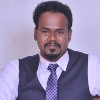</img>
<a href="mailto:gmanogaran@ucdavis.edu"></img></a>
<a href="https://sites.google.com/site/gunasekaranmanogaranprofile/">Gunasekaran Manogaran</a>
postdoc, John Muir Institute for the Environment  
<b> Modeling climate change and disease incidence. </b>
The objective of Guna's research is to propose a big data processing framework using big data predictive modeling techniques and change detection methods to find changes seasonal climate data and extract correlations between the large volume of climate data and disease (dengue) incidence. The outcome of his research focuses on raising public awareness about the health implications of infectious diseases arising from climate changes.

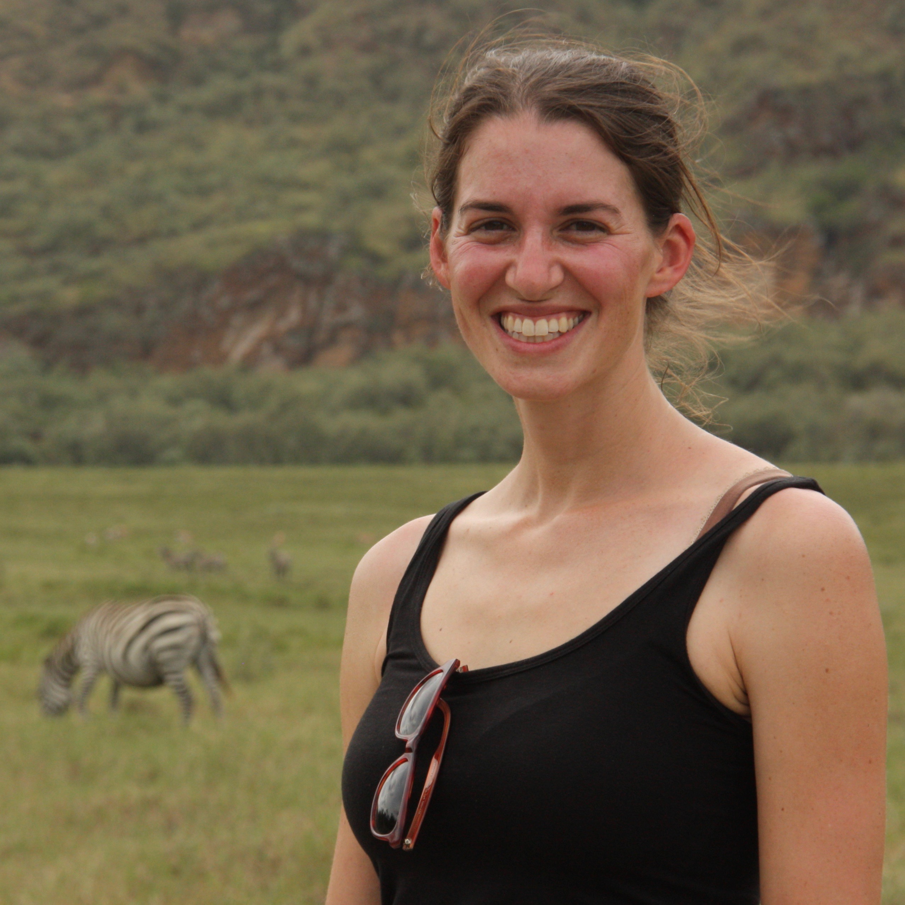</img>
<a href="mailto:rushmore@ucdavis.edu"></img></a>
<a href="http://julierushmore.wixsite.com/diseaseecology">Julie Rushmore</a>
postdoc, Vet Med  
<b> Social and ecological drivers of pathogen transmission dynamics. </b>
Julie is an epidemiologist that uses behavioral ecology and disease ecology to investigate social and ecological drivers of pathogen-transmission dynamics across a range of study systems including non-human primates, ungulates, arthropod vectors, and humans. Julie's work combines field-based empirical data and mathematical modeling to understand pathogen transmission at a local scale, and database analyses to investigate host-pathogen associations on a global scale. Julie uses R for network analysis, modeling, simulations, and data visualization.

## Graduate Students

</img>
<a href="mailto:zakimbekov@ucdavis.edu"></img></a>
<a href="https://akimbekov.com">Zamirbek Akimbekov</a>
graduate student, Statistics  
<b> Statistical and thermodynamic analysis of computationally predicted structures. </b>
Zamir teaches machines to learn. He is interested in the application of machine learning and statistics in pattern recognition, anomaly detection, and prediction. He wants to engage in collaborative data science projects with people from different backgrounds to experiment and learn new data science technologies.

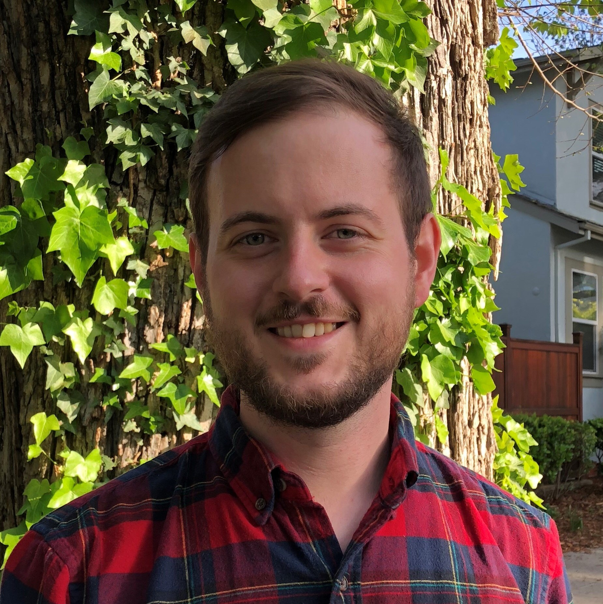</img>
<a href="mailto:dmantovich@ucdavis.edu"></img></a>
<a href="http://psychology.ucdavis.edu/directory-of-people/grad-students#c4=all&b_start=0">Dylan Antovich</a>
graduate student, Psychology Department  
<b> Language and cognitive development. </b>
Dylan's graduate work examines how infants learn about the structure of their native languages at the level of sounds and words, and how experience (e.g., bilingualism) and cognitive abilities influence these processes. He uses Python and R to clean, analyze, and visualize data sets, and looks forward to advancing his skills in these areas and branching out to learn additional analysis and visualization techniques used in data science.

</img>
<a href="mailto:rbarr@ucdavis.edu"></img></a>
<a href="https://www.linkedin.com/in/ryan-barr-5581469a/">Ryan Barr</a>
graduate student, Energy  
<b> Electrifying transportation to integrate renewable energy. </b>
Ryan researches the potential for electric vehicle charging and stationary batteries to better integrate renewable energy, which will reduce the cost and environmental externalities associated with electricity and transportation systems. He is learning to use R and Python to collect, manipulate, and analyze data in order to run better models of the electricity grid.

</img>
<a href="mailto:Mebates@ucdavis.edu"></img></a>
<a href="https://www.linkedin.com/in/mebates">Matthew Bates</a>
graduate student, Civil and Environmental Engineering.  
<b> Decision making under uncertainty. </b>
Matt has a background in computer science, software development, and water resources engineering. He is interested in methods of risk and decision in science, simulation and optimization. He is interested in the broad, data science workflow from ideation and requirements development to results visitation and dissemination. His current research includes data analysis related to engineered infrastructure. Matt wants to learn more about multivariate regression, machine learning, web scraping, and semantic analysis, and improve his expertise in Python and R.

</img>
<a href="mailto:crbelden@ucdavis.edu"></img></a>
<a href="http://coryrbelden.weebly.com/">Cory Belden</a>
graduate student, Political Science.  
<b> How political institutions affect elected representatives and policy outcomes for the environment. </b>
Cory studies how political institutions influence the behavior of elected representatives (i.e., legislators, executives), and how differences in behavior affect policy outcomes related to climate change and the environment. She uses web-scraping, content analysis, and natural language processing (NLP) to obtain and analyze legislative speeches and spatial data to study behaviors across countries (including the United States, Australia, Chile, the UK, and New Zealand). Cory primarily uses R along with spatial methods to overlay political boundaries with relevant measures of "policy problems," such as the severity of drought. Cory is further developing her spatial and text mining skills.

</img>
<a href="mailto:mcbissell@ucdavis.edu"></img></a>
<a href="http://www.vetmed.ucdavis.edu/gge/index.cfm">Michael Bissell</a>
graduate student, Epidemiology  
<b> Differential effects of risk factors on breast cancer outcomes by race. </b>
Michael has a background in statistics and applied mathematics.  His research focuses the on how the attribution of risk factors varies by race with regard to overall breast cancer, late stage breast cancer, and breast cancer mortality.  He would like to learn more about applying machine learning techniques in his research, especially with survival data.

</img>
<a href="mailto:nsbowden@ucdavis.edu"></img></a>
<a href="http://engineering.ucdavis.edu/ttp/">Nicholas Bowden</a>
graduate student, Transportation Technology and Policy.  
<b> Economic environmental policy of energy and transportation. </b>
Nick's background is in theoretical economics and econometrics. His research focuses on the electrification of transportation and carbon policy. He uses high frequency time series data collection and modeling of electric power and transportation systems. Nick is interested in learning programming skills for more efficient methods of compiling data from public and regulated entities. Because these data relate to stationary power sources for the use of stationary transportation networks, he is also interested in visualization of this data onto relevant geographic planes.

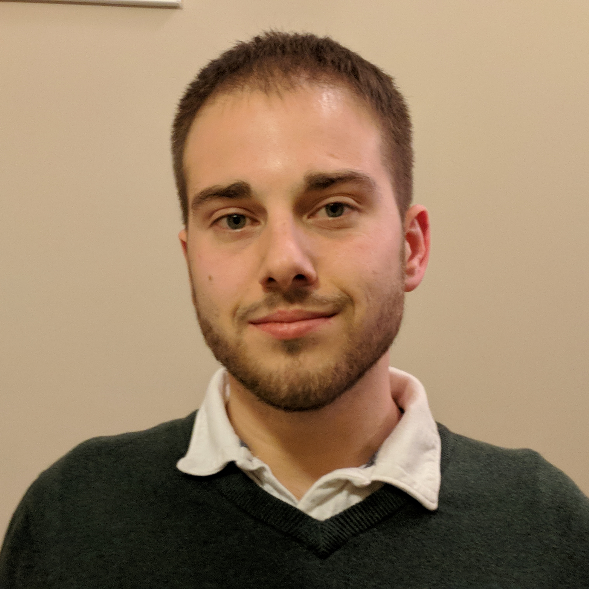</img>
<a href="mailto:djcarlos@ucdavis.edu"></img></a>
<a href="http://dilloncarlos.me">Dillon Carlos</a>
graduate student, Economics  
<b> Economics of open source technology. </b>
Dillon is a PhD student in Economics interested in the economics of open source software in enterprise, natural language processing, and machine learning. Dillon is a regular user of the python ecosystem, shell scripting, and relational databases to extract, clean, manage, and analyze data. He is interested in learning to scale machine learning models and taking advantage of cloud computing resources.

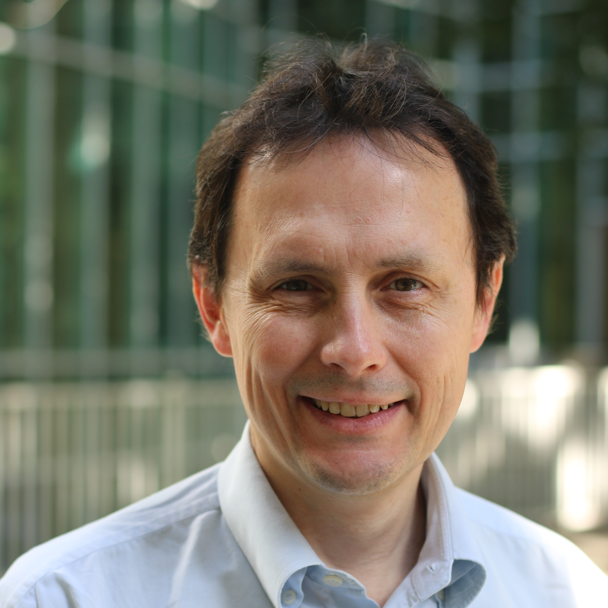</img>
<a href="mailto:rpreta@ucdavis.edu"></img></a>
<a href="">Rinaldo Catta-Preta</a>
graduate student, Integrative Genetics and Genomics.  
<b> Comprehensive, novel ways to define and integrate gene regulatory networks (GRNs) in early neurodevelopment. </b>
Rinaldo is working on establishing and integrating GRNs for cortical interneuron proliferation, migration and specification, by associating gene co-expression with binding of transcription factors to DNA regulatory elements (promoters and enhancers), and chromatin states. He is interested in developing high-dimensional, deep learning approaches to generate systems-level, predictive models of regulatory element function and gene regulation during brain development; furthermore, he is interested in, having the models, back generate interpretable representations to drive further feature discovery. Rinaldo has a strong background in Perl and other ancillary languages, but is currently pursuing expertise in Python and R, and efficient HPC. Machine learning interests focus on neural nets, HMMs and deep learning.

</img>
<a href="mailto:kacorn@ucdavis.edu"></img></a>
<a href="http://katherinecorn.wordpress.com">Katherine Corn</a>
graduate student, Population Biology.  
<b> Form, function and diversity of fishes. </b>
Katherine is a macro-evolutionary biologist. She uses fish phylogenies for comparative analyses and is pursuing integrating mechanical models with kinematic data from high speed videos. She want to learn how to work effectively, efficiently and cleanly with large, messy phylogenetic and kinematic datasets.

</img>
<a href="mailto:rjdhaliwal@ucdavis.edu"></img></a>
<a href="http://english.ucdavis.edu/people/ranjodh">Ranjodh Singh Dhaliwal</a>
graduate student, English  
<b> Quantitative digital humanities. </b>
Ranjodh has a background in computer science and is interested in contemporary literature, art, videogame studies, science and technology studies, and new media theory. He uses topic modeling and Neural Networks for his natural language processing research.
He wants to explore the intersections between NLP and machine learning, and exploring theory in data science.

</img>
<a href="mailto:smdevine@ucdavis.edu"></img></a>
<a href="https://casoilresource.lawr.ucdavis.edu/">Scott Devine</a>
graduate student, Soils and Biogeochemistry  
<b> Natural resources database to address society, agriculture and the environment. </b>
Scott works in the Department of Land, Air, and Water resources. He has international, hands-on, scientific, and management experience in agriculture, combined with a passion and curiosity for seeking sustainable solutions to challenging problems.
He uses R to work with the Soil Survey Geographic Database (SSURGO), the most complete natural resources database in the United States. He is merging SSURGO with other geographic data to answer questions of broad relevance to society, agriculture, and the environment.
Scott wants to learn advanced programming and the skills to work with challenging and complex data sets, many of which have spatial and temporal dimensions.

</img>
<a href="mailto:nellinwood@ucdavis.edu"></img></a>
<a href="http://www.ucdmc.ucdavis.edu/pharmacology/">Nicholas Ellinwood</a>
graduate student, Pharmacology and Toxicology  
<b> Identifying optimal drug characteristics to improve pharmacological options to prevent heart attacks. </b>
Nick's research involves using computational approaches to reveal the cellular and molecular mechanisms of cardiac arrhythmias.
He is working to apply in vivo and in silico data related to healthy and diseased cardiac function to the clinical setting.

</img>
<a href="mailto:eestradaa@ucdavis.edu"></img></a>
<a href="http://dynamics.ucdavis.edu/people.html">Eduardo Estrada</a>
graduate student, Psychology.  
<b> Longitudinal and dynamic data analysis for behavioral and health sciences. </b>
Eduardo is interested in  tools and techniques to study change. Specifically, he is interested in advancing statistical methods for characterizing developmental change in psychological constructs (such as cognitive abilities) over time. He is particularly interested in applications of dynamical systems and differential equations to psychology, and the study of change at the individual level. He conducts most of his analyses in R, applying various forms of general linear models and structural equation models.

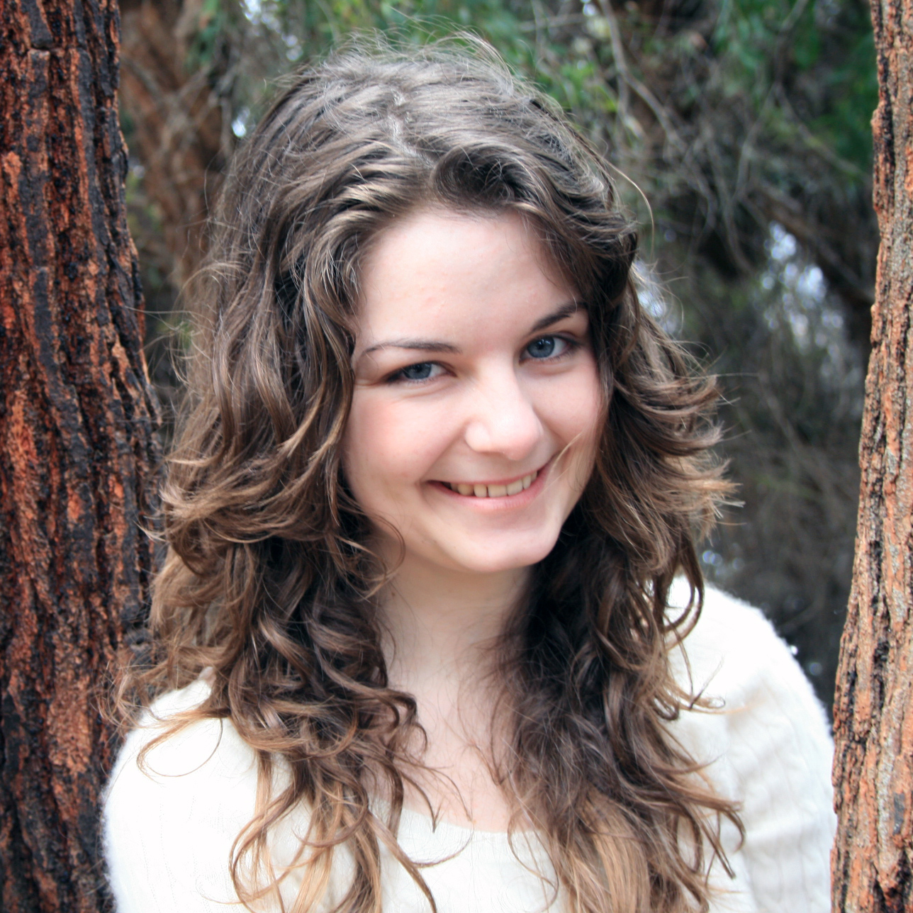</img>
<a href="mailto:clettinger@ucdavis.edu"></img></a>
<a href="https://seagrassmicrobiome.org/people/cassie-ettinger/">Cassie Ettinger</a>
graduate student, Integrative Genetics & Genomics  
<b> Seagrasses as models for studying adaptation of plant-fungi symbioses to marine ecosystems. </b>
Cassie's interests include plant-microbe interactions and host-microbe co-evolution. Her projects involve analyzing a variety of types of high throughput sequencing data (16S/18 rRNA, ITS, genomics, metagenomics) from environmental microbial communities and cultured isolates using a combination of Python, R and Unix/bash. Cassie hopes to expand her knowledge of statistical modeling and machine learning algorithms to improve her research and enjoys learning more about data visualization and workflow reproducibility.

</img>
<a href="mailto:rcfitzgerald@ucdavis.edu"></img></a>
<a href="https://www.stat.ucdavis.edu">Clark Fitzgerald</a>
graduate student, Statistics.  
<b> Computational technologies that enable data science at scale. </b>
Clark is working on improving R through parallel computing. He'd like to learn about interesting applications and related data sets.

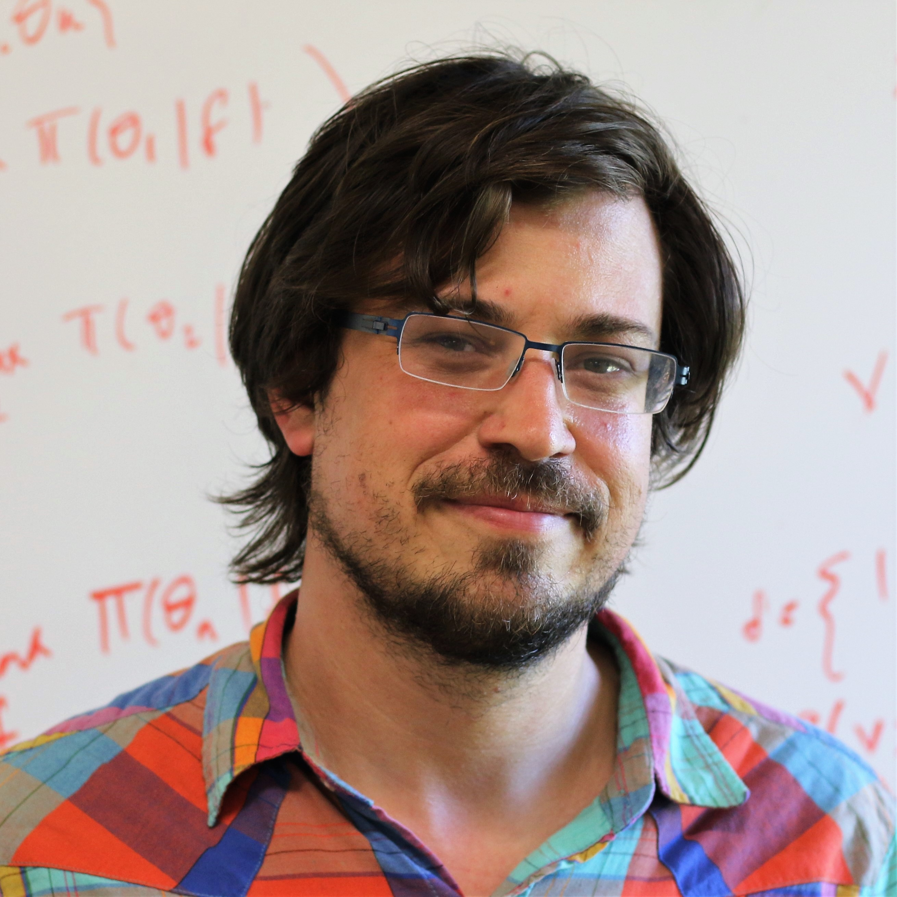</img>
<a href="mailto:scgeer@ucdavis.edu"></img></a>
<a href="http://sociology.ucdavis.edu/people/scgeer">Shaun Geer</a>
graduate student, Sociology  
<b> The science of conducting science. </b>
Shaun's research uses large datasets to examine how we do research in science and medicine. He has experience with web crawling/scraping and computational linguistics. Shaun wants to learn more about Bayesian statistical techniques (e.g., MCMC).

</img>
<a href="mailto:acgetchell@ucdavis.edu"></img></a>
<a href="https://keybase.io/adamgetchell">Adam Getchell</a>
graduate student, Physics  
<b> Quantum gravity using computational models. </b>
Adam has a general background in information technology and programming experience (C++, Python, C#, Lisp, Clojure, and F#, among others). Adam has experience with running MCMC (Monte Carlo Markov Chain) and related methods. Adam wants to learn R and more statistics, data science methods, and anything else related to collating/analyzing large data sets.

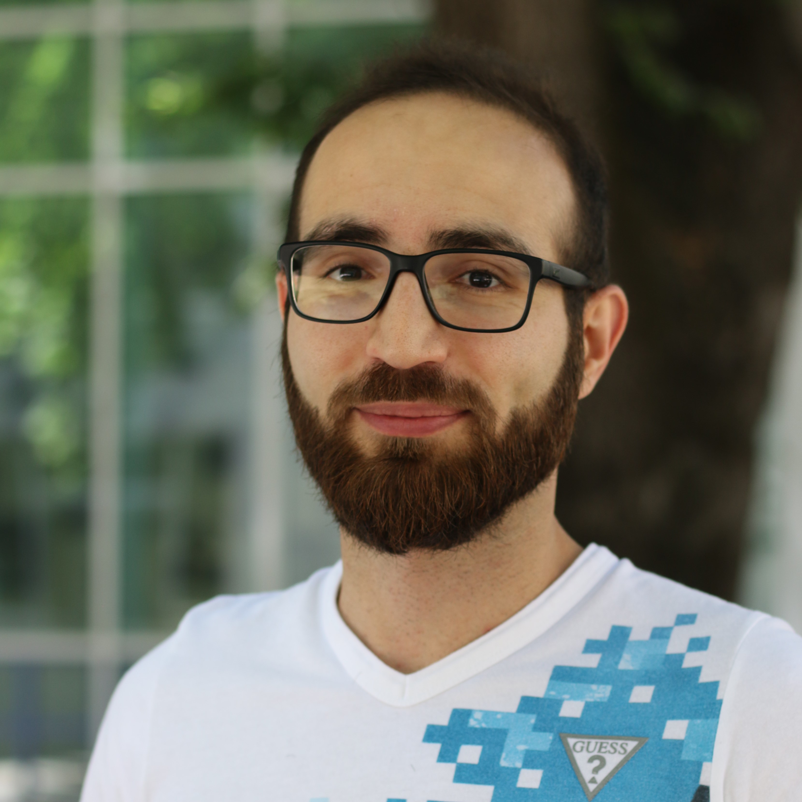</img>
<a href="mailto:egholami@ucdavis.edu"></img></a>
<a href="http://www.ece.ucdavis.edu/">Ehsan Gholami</a>
graduate student, Electrical and Computer Engineering  
<b> Online social media user behavior and purchasing patterns. </b>
Ehsan is using business datasets combined with online social media information to predict user attributes based on user behavior. Ehsan is interested in collaborating with colleagues from various departments to learn relevant information, techniques and tools that others find useful.

</img>
<a href="mailto:dhagood@ucdavis.edu"></img></a>
<a href="http://education.ucdavis.edu/dhagood">Danielle Hagood</a>
graduate student, Education  
<b> Noncognitive constructs in K12 settings using computational psychometrics. </b>
Danielle's research draws on intensive, multi-modal data to produce learning analytics offering individual-level insights and, in aggregate, informs teaching and policy. Her practice-embedded research
foregrounds the needs of teachers and students, with a critical SES perspective. She uses data science approaches to structure messy data and creatively identify data sources. Danielle wants to learn more advanced programming for data in R and Python, and to engage in collaborative reading and working groups on applied machine learning.

</img>
<a href="mailto:lmhuang@ucdavis.edu"></img></a>
<a href="http://lisamhuang.wordpress.com/">Lisa Huang</a>
graduate student, Psychology  
<b> Social perception, impression formation, and decision making. </b>
Lisa is a social psychologist who studies how social expectancies influence the ways that people form impressions of others. She is interested in using predictive modeling to understand and change human behavior. She wants to expand her knowledge in machine learning and build skills in R, SQL, and data visualization.

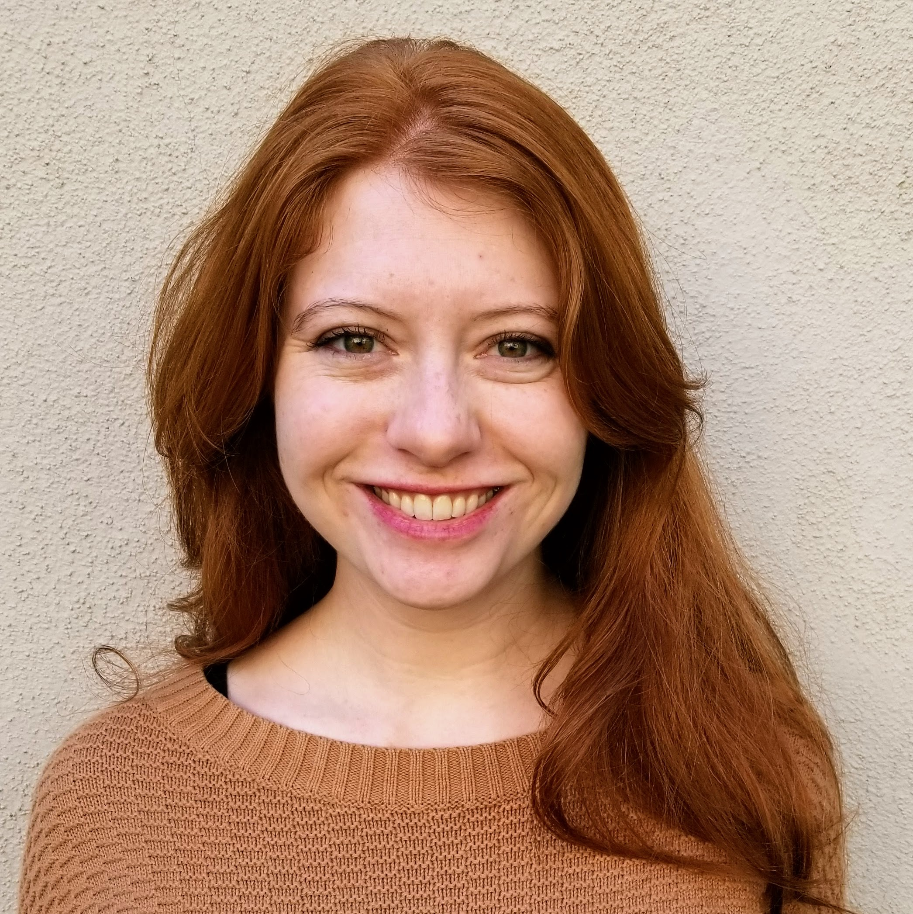</img>
<a href="mailto:driltis@ucdavis.edu"></img></a>
<a href="NA">Dana Iltis</a>
graduate student, Computer Science.  
<b> Machine Learning Techniques for Automated Software Testing. </b>
Dana is an MS student in the Computer Science department. For her thesis she is working on improving existing automated software testing tools by using machine learning techniques to analyze program input/output data to gain insights into software behavior. Dana earned her bachelor's in Math-Economics from UCLA, and she worked as a financial software developer for 4 years in Santa Barbara, CA before beginning her graduate degree.

</img>
<a href="mailto:lcirberjr@ucdavis.edu"></img></a>
<a href="http://luizirber.org">Luiz Carlos Irber, Júnior</a>
graduate student, Computer Science  
<b> Genomic sequencing data, decentralized data sharing, computational skills. </b>
Luiz is developing methods for biological data analysis in Python and C++ using Jupyter notebooks; pipelines with Spark, Dask and snakemake; and data distribution using IPFS and dat. Luiz wants to collaborate with researchers from other areas to find common methods and share experiences.

</img>
<a href="mailto:jnjoseph@ucdavis.edu"></img></a>
<a href="http://sociology.ucdavis.edu/people/jnjoseph">Jared Joseph</a>
graduate student, Sociology  
<b> Surveillance and crime using social network analysis and statistical analysis in R. </b>
Jared has prior experience with SPSS and Stata, and is interested in big data, network data, and online environments (social networking sites, MMOs, online forums).

</img>
<a href="mailto:sejoslin@ucdavis.edu"></img></a>
<a href="http://igg.ucdavis.edu/">Shannon Joslin</a>
graduate student, Integrative Genetics and Genomics  
<b> Heritable phenotypes, population genomics and disease risk in human populations. </b>
Shannon's research interests include population genomics, genome-wide association studies and metagenomics. She wants to learn about handling and visualizing big data.

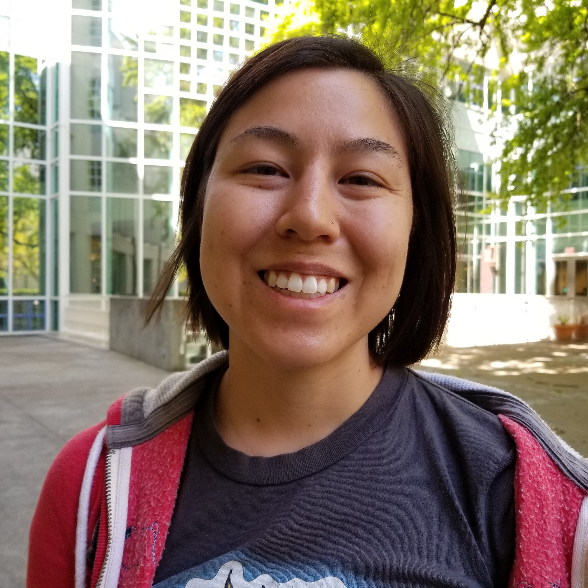</img>
<a href="mailto:hkahl@ucdavis.edu"></img></a>
<a href="https://hannakahl.com/">Hanna Kahl</a>
graduate student, Entomology.  
<b> Using an ecoinformatics approach to improve citrus pest management. </b>
I explore data collected from actual citrus fields in the San Joaquin valley for interesting trends that influence damage or yield of citrus fruits. Then I design experiments to assess the intricacies of the trends observed. I am especially interested in the variation in herbivore damage to citrus fruits across citrus variety. I primarily use R in exploring and analyzing my data but I am interested in becoming more proficient at Python and SQL. Broadly, I aim to use data science technologies to improve the economic gain and sustainability of agricultural production practices.

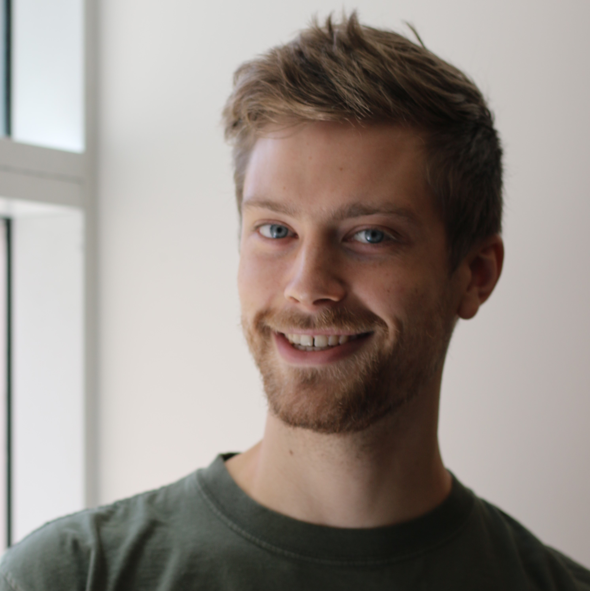</img>
<a href="mailto:ekal@ucdavis.edu"></img></a>
<a href="https://ekalosak.github.io">Eric Kalosa-Kenyon</a>
graduate student, Statistics  
<b> Application-driven statistical and computational methodology. </b>
Prior to grad school Eric worked as a Computational Research Associate in the Data Science group at Indigo Agriculture.
His research is in mathematical statistics. Eric is especially interested in collaborating with domain scientists on pragmatic projects in pursuit of the University's mission
to improve the quality of life for everyone.

</img>
<a href="mailto:mrkardish@ucdavis.edu"></img></a>
<a href="http://melissakardish.wordpress.com">Melissa Kardish</a>
graduate student, Population Biology  
<b> Microbial ecology of seagrass communities. </b>
Melissa has worked with terrestrial plants, ants, birds, and fungi, and now works with the plants, animals and microbes in the sea.
She is broadly interested in patterns of species diversity and how different communities of microbes have different effects on seagrass and seagrass-associated communities.
Melissa works with data describing microbial communities. She primarily uses R, but also with other languages to process and analyze sequencing data.
Melissa credits her experience at the DSI with helping her to learn cleaner and more efficient workflows. She hope to learn new skills that she can apply later when facing problems in collaborations or in her own research.

</img>
<a href="mailto:hpheasant@ucdavis.edu"></img></a>
<a href="NA">HannahJoy Kennedy</a>
graduate student, Weed Science / IAD  
<b> Weed vs. crop differentiation using crop marking systems. </b>
HannahJoy is an engineer who's thesis research is on using robots for weeding commercial vegetable fields. HannahJoy is interested in visual communication of data such as interactive maps.

</img>
<a href="mailto:nlashinsky@ucdavis.edu"></img></a>
<a href="http://paleoanthropology.ucdavis.edu/nikolai-veter.html">Nick Lashinsky</a>
graduate student, Anthropology  
<b> Exploring and developing models of morphological evolution in a phylogenetic context. </b>
Nick's research is at the intersection of biological anthropology and Bayesian phylogenetics. He work primarily with character alignments (both continuous, e.g., linear measurements on the primate skeleton, and discrete, e.g., binary traits and nucleotide sequences), attempting to make inferences regarding the evolutionary processes that gave rise to them. Nick wants to learn new programming languages and software libraries/frameworks (e.g., Python, TensorFlow, Hadoop) and methods (e.g. artificial neural networks). He also wants to expand his toolkit to include machine learning and data visualization.

</img>
<a href="mailto:frnliang@ucdavis.edu"></img></a>
<a href="http://www.stat.ucdavis.edu/">Yuefeng Liang</a>
graduate student, Statistics  
<b> Extreme multi-label classification. </b>
Yuefeng has experience in machine learning, biostatistics, spatial statistics and high-dimensional statistics.	Yuefeng wants to learn more about natural language processing and imaging.

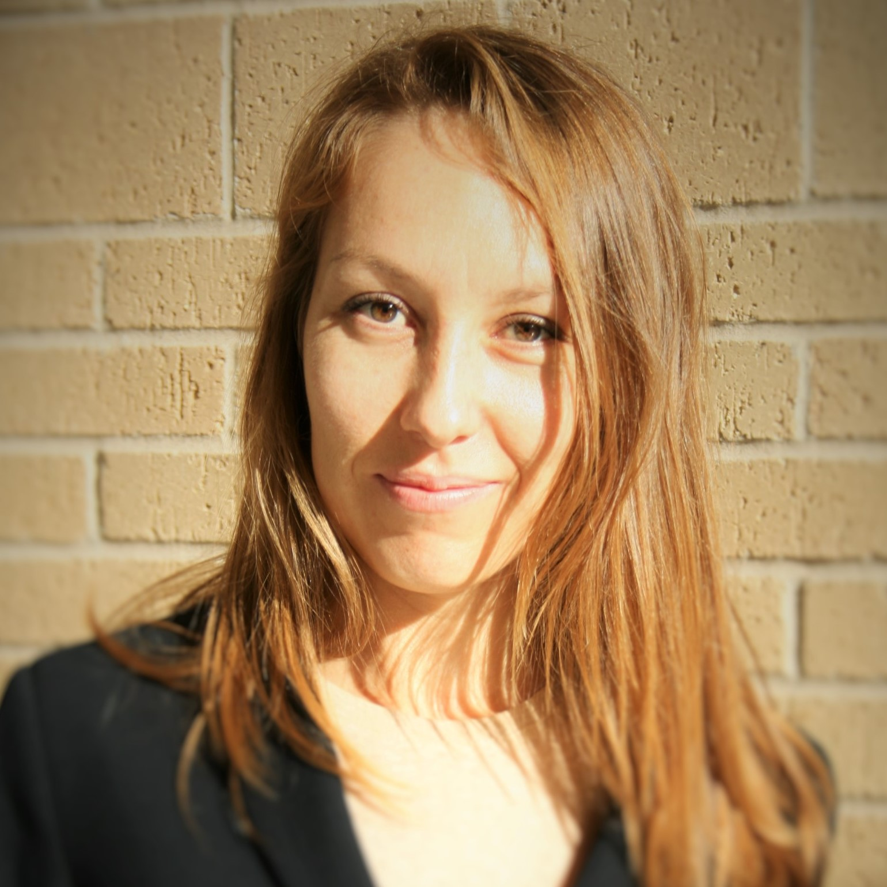</img>
<a href="mailto:mlovchikova@ucdavis.edu"></img></a>
<a href="http://economics.ucdavis.edu/">Marina Lovchikova</a>
graduate student, Economics  
<b> Technological change and macroeconomic policies. </b>
Marina's background is in theoretical economics and applied statistics. Currently, she studies how technological change influences labor market policies. She uses R, MATLAB and Stata for model simulations and data analysis. Marina is interested in efficient data extraction techniques, text mining and natural language processing (NLP).

</img>
<a href="mailto:smaillie@ucdavis.edu"></img></a>
<a href="https://www.stat.ucdavis.edu/people/grad-students.html">Samantha Maillie</a>
graduate student, Statistics.  
<b> Applying statistics to healthcare and social sciences. </b>
Samantha is a masters student interested in applying statistical methods to answer a variety of questions with a particular interest in problems in healthcare and social sciences. She hopes to develop a deeper understanding of machine learning, python and R through working with like minded individuals.

</img>
<a href="mailto:hmailhot@ucdavis.edu"></img></a>
<a href="http://www.cs.ucdavis.edu/">Hugo Mailhot</a>
graduate student, Computer Science  
<b> Computational linguistics and machine learning. </b>
Prior to coming to UC Davis, Hugo was prototyping natural language processing (NLP) applications in industry. His research focuses on node attribute prediction in networks and network spreading dynamics, and requires a combination of network science, NLP, hard problem approximation, and machine learning. Hugo has a background in NLP and supervised learning, and has experience in web scraping, data management, data cleaning and exploratory analysis, primarily in Python. Hugo wants to broaden his foundation in statistics, start playing around with neural networks, learn R, and build interactive visualizations such as web apps.

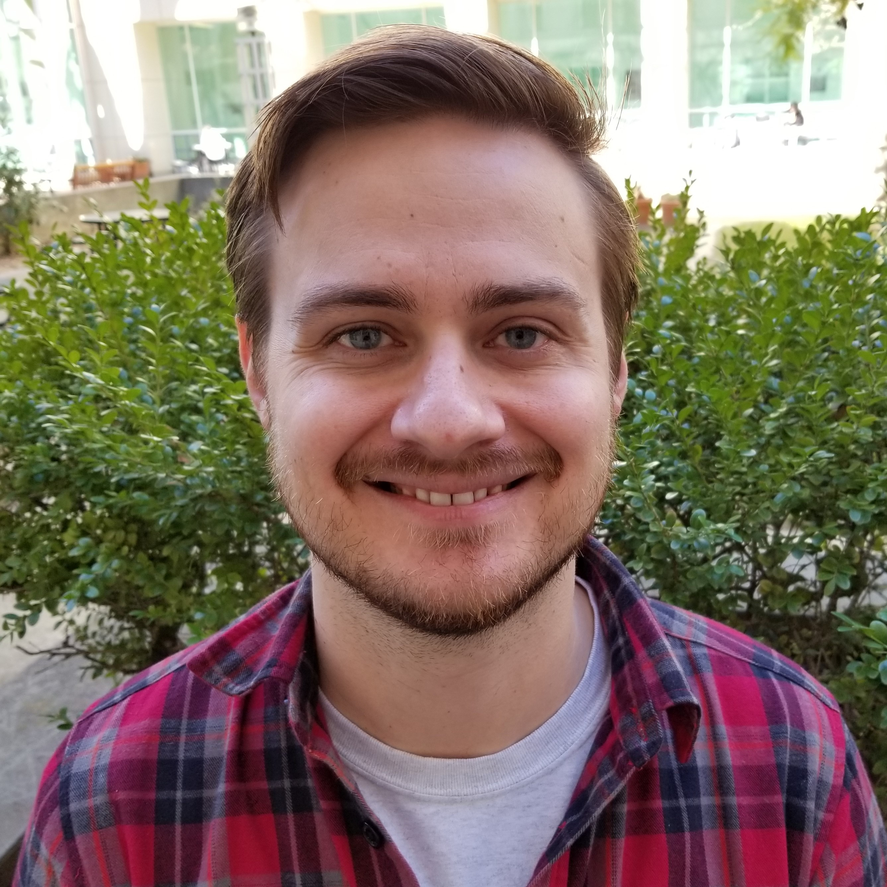</img>
<a href="mailto:jthmiller@ucdavis.edu"></img></a>
<a href="http://jthmiller.github.io/">Jeffrey Miller</a>
graduate student, Pharmacology and Toxicology.  
<b> Rapid evolutionary strategies in human-altered environments. </b>
Currently, Jeffrey is using gene expression and quantitative genomics to determine how separate populations of an estuary fish evolved resistance to toxic pollutants. Jeff is interested in teaching command line computational skills and learning more about the visualization and analysis of complex whole-genome/transcriptome/phenotype datasets with R, python, and Circos.

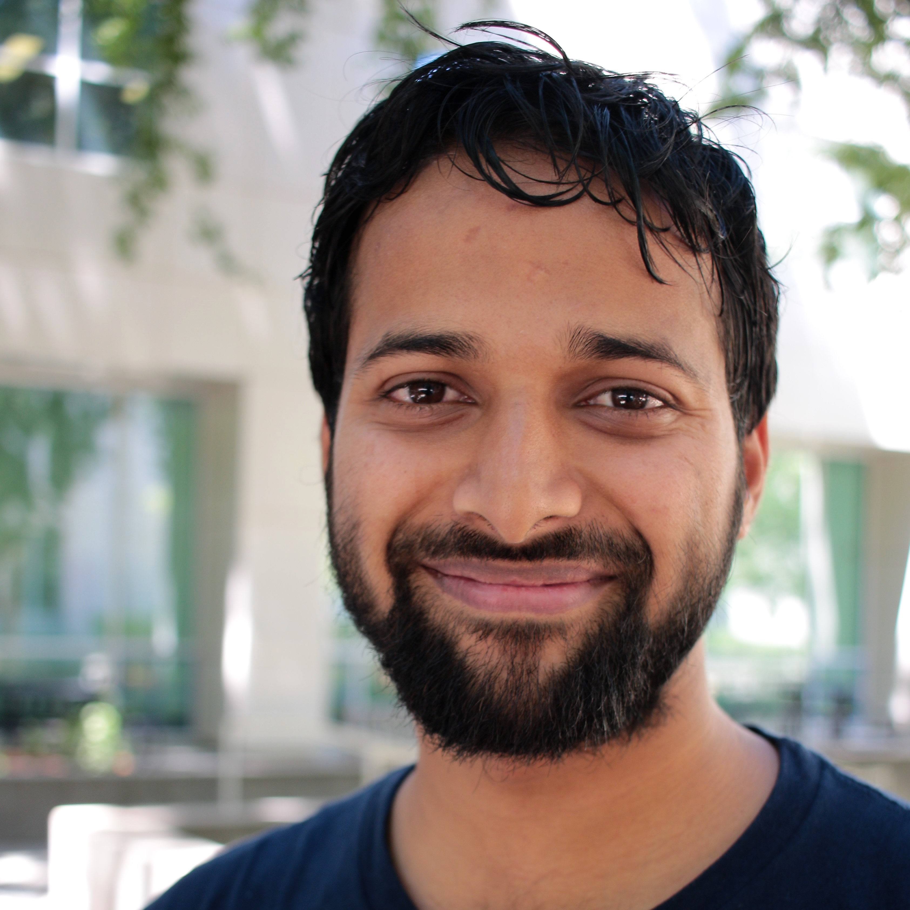</img>
<a href="mailto:sismail@ucdavis.edu"></img></a>
<a href="http://shaikhismail.github.io">Shaikh Mohammed Ismail</a>
graduate student, Computer Science.  
<b> Is software code a natural language?. </b>
Ismail is studying how similar software source codes written by humans are to the natural language text.
He is exploring the advancements of deep learning in the field of computer vision and applying it to his research.
He wants to learn all the cool things my other colleagues at DSI can offer. On a technical level, Ismail wants to get involved in open source development in Artificial Intelligence/Deep learning.

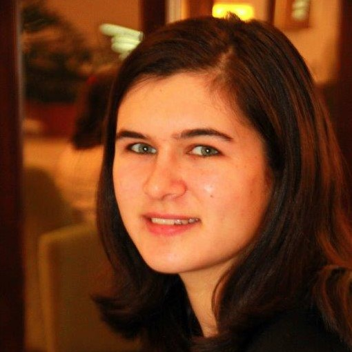</img>
<a href="mailto:tsnelsen@ucdavis.edu"></img></a>
<a href="https://tnelsen.github.io/">Taylor Nelsen</a>
graduate student, Horticulture and Agronomy.  
<b> Proximal sensing for better nitrogen management. </b>
Taylor is working on improving nitrogen management through modeling grain response to nitrogen and developing nitrogen rate recommendations. She collects and uses traditional agronomic data in conjunction with many new technologies such as proximal sensing devices, high resolution imagery and GIS. Taylor primarily uses R and QGIS to analyze this data but wants to learn more about managing and incorporating data from different sources.

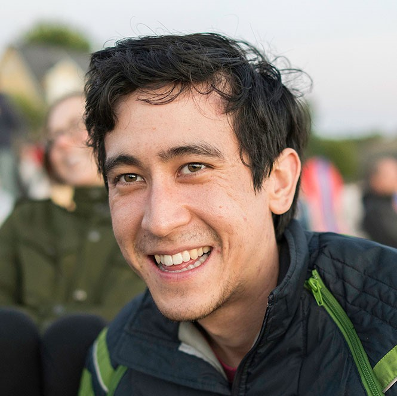</img>
<a href="mailto:slnoah@ucdavis.edu"></img></a>
<a href="osf.io/h5crj">Sean Noah</a>
graduate student, Psychology  
<b> Neural mechanisms of attention. </b>
Sean studies the networks in the brain that control attention. Sean collects electroencephalography and functional magnetic resonance imaging data from human research participants while they perform various attention-intensive tasks, and uses signal processing, network analysis, and machine learning applications to model the underlying neural activity. Sean thinks that data science will be increasingly crucial to advancing neuroscience, especially as neural datasets grow rapidly in size and complexity.

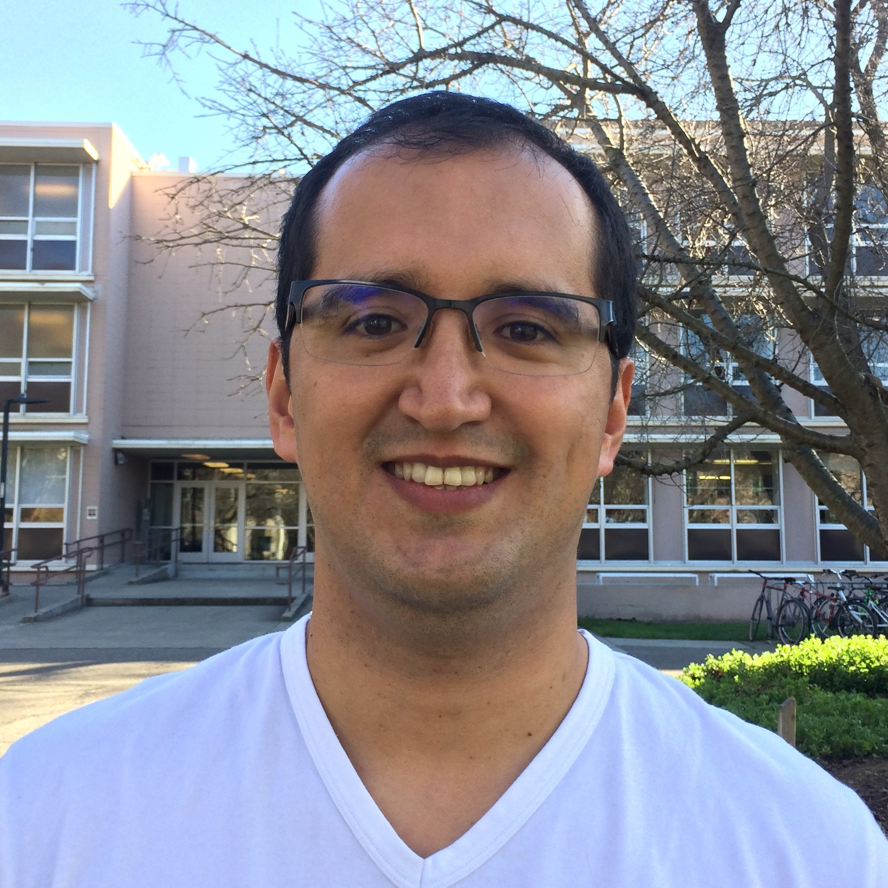</img>
<a href="mailto:jiochoa@ucdavis.edu"></img></a>
<a href="http://biogeo.ucdavis.edu/people.html">Jose Ochoa</a>
graduate student, Geography  
<b> Cropland detection in the Andes using moderate-high resolution satellite data. </b>
Jose (Pepe) is a geographer who specializes in remote sensing applications for terrestrial ecosystems monitoring. His current research is focused on cropland expansion and ecosystem alteration in the Ecuadorian Andes, testing different land cover classification algorithms and climatic models. He mainly uses Google Earth Engine, ENVI IDL, and R as programming platforms. Jose wants to learn more about different geospatial and biophysical datasets used by other colleagues on campus.

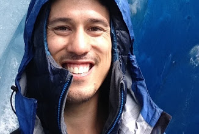</img>
<a href="mailto:rpauloo@ucdavis.edu"></img></a>
<a href="richpauloo.github.io">Rich Pauloo</a>
graduate student, Hydrologic Science  
<b> Numerical modeling of groundwater flow and contaminant transport. </b>
Rich is a hydrologic scientist who studies how water management affects the sustainability of groundwater resources. In his research, Rich works with geospatial, chemical, timeseries, geophysical data, and enjoys dabbling in natural language processing on the side. He has made a few R Shiny apps, and is excited to learn more tools and techniques for modeling, visualizing and telling compelling stories with data. Rich primarily codes in R and git, and uses python on blue moons.

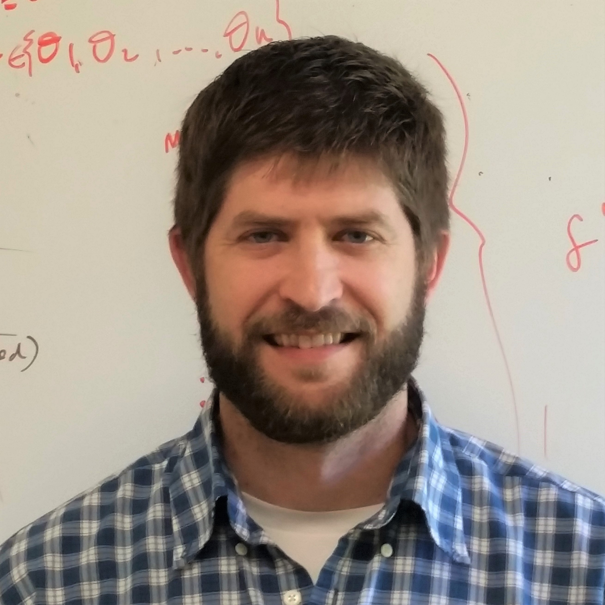</img>
<a href="mailto:rapeek@ucdavis.edu"></img></a>
<a href="http://ryanpeek.github.io">Ryan Peek</a>
graduate student, Ecology  
<b> Effects of land-use change on the population genomics of sensitive frog species. </b>
Ryan is a watershed scientist who studies the effects of river regulation and landscape change in freshwater systems. Ryan works with many types of data, including genomic, hydrologic, biologic, and climate, both "tidying" and aggregating as well as modeling and visualization. Ryan coordinates the [Davis-R-Users-Group](https://d-rug.github.io/) and routinely uses bash and git.
Ryan enjoys learning new tools and methods and troubleshooting R problems. He's looking to continue learning novel and robust ways to analyze data.

</img>
<a href="mailto:rcphillips@ucdavis.edu"></img></a>
<a href="http://davisig.org/members/ryanphillips/">Ryan Phillips</a>
graduate student, Neuroscience  
<b> Analyzing attention lapses, emotional regulation, impulse control, and how these phenomena interact to shape how we behave and perceive the world. </b>
Ryan is interested in the role of data science in relation to personal data collection, and is fascinated by SQL, machine learning, and artificial neural networks. He recently uploaded his dissertation data to postgres, and conducted user analytics for a startup (Remind) in San Francisco.
Ryan wants to engage with like-minded data scientists and continue to learn about the latest advances in the field.

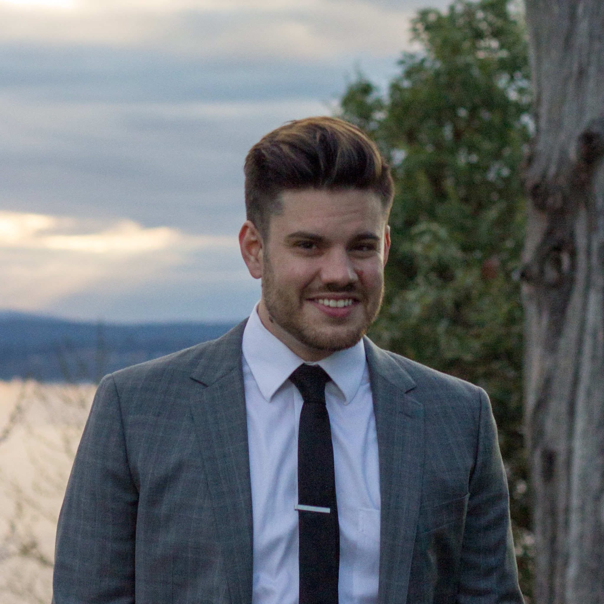</img>
<a href="mailto:spizelo@ucdavis.edu"></img></a>
<a href="https://ucdavis.academia.edu/SamuelPizelo">Samuel Pizelo</a>
graduate student, English Literature  
<b> From early modern texts to game studies. </b>
Samuel is a PhD student in the English department who focuses in Science and Technology Studies and Game Studies. He is interested in using computational tools critically to re-evaluate conventional disciplinary knowledge and archives. Currently, he is involved with a project using R to analyze Early Modern textbases.

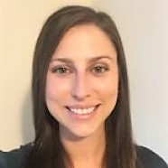</img>
<a href="mailto:cmpollard@ucdavis.edu"></img></a>
<a href="http://english.ucdavis.edu/people/cpollard">Courtney Pollard</a>
graduate student, English  
<b> Digital humanities and early modern English literature. </b>
Courtney studies early modern English literature and is specifically interested in cultural geography, literacy studies and digital humanities. Her research involves data mining and topic modeling literary corpora. Currently, she is learning R and exploring different digital humanities methods and theories.

</img>
<a href="mailto:poncedeleon@ucdavis.edu"></img></a>
<a href="http://alejandroponcedeleon.co">Alejandro Ponce de León - Calero</a>
graduate student, Cultural Studies  
<b> “Thinking data”: Epistemological preliminaries for a qualitative analysis of the Big Data phenomenon. </b>
Alejandro is a social scientist whose work stands at the crossroads between the humanities and data science. His work integrates different information sources and methodologies, ranging from interviews and ethnography to political panel data and statistics. Alejandro is interested in exploring how we, as scientists, think about the many expressions of correlation and causality. He likes to talk but, mostly, read.

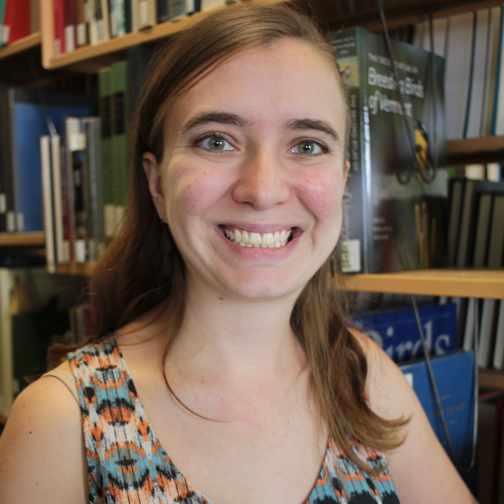</img>
<a href="mailto:ampopa@ucdavis.edu"></img></a>
<a href="https://www.linkedin.com/in/abbiepopa">Abbie Popa</a>
graduate student, Neuroscience  
<b> Behavior and EEG testing of teen anxiety. </b>
Abbie is trained as a cognitive neuroscientist and studies how teenagers’ attention and inhibition are affected by anxiety they experience. Abbie collects and analyzes data from these teenagers including behavioral data, electroencephalography (EEG), and physiological data. She uses techniques including k-means clustering, independent components analysis, mixed effects linear models, and the jack-knife approach to organize, analyze, and interpret these messy, complex data. Abbie participates in the machine learning reading group and DSI un-seminars, and routinely uses Python (pandas, sklearn, h2o) and R (nlme, ggplot). Abbie is working to further her understanding of the underpinnings of machine learning, and learn interactive visualization tools.

</img>
<a href="mailto:nrandhawa@ucdavis.edu"></img></a>
<a href="https://nistara.net">Nistara Randhawa</a>
graduate student, One Health Institute (http://www.vetmed.ucdavis.edu/ohi/)  
<b> Bat movements and viruses, and network modeling of diseases. </b>
Nistara is an Epidemiology PhD candidate working with the PREDICT project at the One Health Institute, which is involved in global surveillance for viruses that can spillover from animals to people. She tracks bat movements and simulates disease outbreaks across geospatial networks and uses R and other GIS tools like ArcGIS/QGIS/GRASS for data munging, analyses, and visualization. She’s looking to learn more on parallel computing, NLP, machine learning, and cloud computing.

</img>
<a href="mailto:jrector@ucdavis.edu"></img></a>
<a href="NA">Jeff Rector</a>
graduate student, Psychology  
<b> Human and machine perception. </b>
Jeff is a cognitive scientist interested in how we derive knowledge from the complex flow of information that reaches our eyes and ears, and how we detect the structure of the world using information from multiple senses. His current research examines how we track and remember patterns of change in events as they unfold over time. Jeff enjoys learning new ways to model data and gaining insight by approaching problems from different directions.

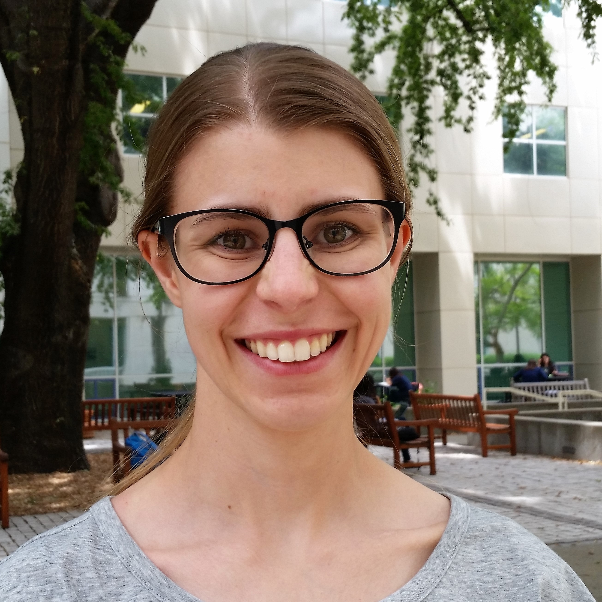</img>
<a href="mailto:tereiter@ucdavis.edu"></img></a>
<a href="http://taylorreiter.github.io">Taylor Reiter</a>
graduate student, Food Science  
<b> Olives & olive oil. </b>
Taylor works with genomic, transcriptomic, and metabolomic data to draw insights about relationships between organisms and food. Taylor is a Software and Data Carpentry Instructor, helps at weekly Meet and Analyze Data sessions hosted by the Lab for Data intensive biology at UC  Davis, and uses bash, git, R, and sometimes python in her workflows. She enjoys helping others learn bioinformatics and data science practices, and likes learning about practices to make data science more repeatable.

</img>
<a href="mailto:ashsaboori@ucdavis.edu"></img></a>
<a href="https://ashkansaboori.github.io">Ashkan Saboori</a>
graduate student, Civil and Environmental Engineering  
<b> Developing predictive performance models for California's highway network using machine learning. </b>
Ashkan is a PhD student in the Civil and Environmental Engineering department. He is currently working on large-scale performance data that is collected from California's highway network by Caltrans through automated pavement condition surveys (APCS) which covers close to 50 thousand lane-miles of roads. His research is focused on statistical analysis and machine learning models that can accurately predict the pavement condition with time. This is essential for optimizing the timing of system maintenance and minimizing system management costs. Ashkan is interested in statistical modeling and machine learning for data-driven decision making and optimization. He is also open to research projects in other fields to diversify his experience.

</img>
<a href="mailto:sysanders@ucdavis.edu"></img></a>
<a href="http://igg.ucdavis.edu/">Soné Sanders</a>
graduate student, Maloof Lab  
<b> Developing genomic prediction software for plant breeding. </b>
Soné is implementing statistical models to forecast the best cross for superior progeny phenotypes for Brassica and, ideally, other plant species. She is also working to isolate genotype by environment predictors to inform plant breeders which of their existing plants could be bred to produce progeny that flourish outside of the normal environment. She works mainly in R and with some Python and is interested in increasing her forecasting and database skills.

</img>
<a href="mailto:shaoyiqun1992@gmail.com"></img></a>
<a href="https://www.ucdavis.edu/majors/applied-mathematics/">Yiqun Shao</a>
graduate student, Applied Mathematics  
<b> Graph theory, text mining and harmonic analysis. </b>
Yiqun's background is in theoretical math and he is currently focusing on applied mathematics. He uses natural language processing and image processing.  He is interested in learning more natural language processing and other topics related to data science.

</img>
<a href="mailto:osonmez@ucdavis.edu"></img></a>
<a href="https://www.stat.ucdavis.edu/people/grad-students.html">Ozan Sonmez</a>
graduate student, Statistics  
<b> Functional Data Analysis, highly dimensional time series, mathematical statistics, complex data visualization. </b>
Ozan is working on data analysis and visualization via interactive platforms, develping Shiny Apps to process/visualize/analyze large data sets specifically for agricultural data, which are highly unbalanced and complex in nature.
He wants to learn about deep learning and its applications in the high dimensional time series prediction problems, and improve his python coding skills

</img>
<a href="mailto:ataranov@ucdavis.edu"></img></a>
<a href="http://biostat.ucdavis.edu/about/students.html">Aleksandra Taranov</a>
graduate student, Biostatistics and International Agricultural Development  
<b> Stochastic Simulations for Plant Breeding Research </b>
Aleks writes R packages that brings new statistical methods and machine learning techniques to the development of drought resistant crops. She'd like to continue developing her skills in C++ and rcpp and get some practice with data cleaning and wrangling.

</img>
<a href="mailto:LATO@ucdavis.edu"></img></a>
<a href="http://lidaanitato.org">Lida Anita To</a>
graduate student, Integrative Genetics & Genomics  
<b> Evolutionary history of conifers. </b>
Working on the largest genome sequences to-date, Lida is interested in recreating the evolutionary histories of conifer species using population genomics and demographic inference models (such as Markov Chain Coalescent models). She uses population genetic statistics, probability, and stochastic theory for analysis of large data structures (i.e., genomic DNA data) in Python, R, Perl, C++, and Unix/bash. Lida would like learn more about coding efficiency (unit-testing, other tips & tricks, etc.), handling of big data structures in R, Python, Perl, and C++, and machine learning.

</img>
<a href="mailto:gmturco@ucdavis.edu"></img></a>
<a href="http://www.sudogenes.com/">Gina Turco</a>
graduate student, Biochemistry, Molecular, Cellular and Developmental Biology (BMCDB)  
<b> Modeling gene regulatory networks in plants as regulatory circuits. </b>
Gina uses R, python and SQL for data analysis. She's taken classes and is interested in both control theory and Bayesian modeling.
Gina is interested in learning more about machine learning and modeling.

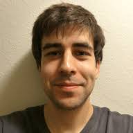</img>
<a href="mailto:naulle@ucdavis.edu"></img></a>
<a href="https://github.com/nick-ulle">Nick Ulle</a>
graduate student, Statistics  
<b> Compiling high-level scientific programming languages. </b>
Nick studies compilers, the programs that rewrite or translate source code to make it more efficient. He has expertise with R and Julia and is interested in STEM pedagogy, interface design, and Monte Carlo methods. In addition to his primary research, Nick works on data extraction and analysis projects at the DSI, teaches statistical computing workshops, and offers advice about statistics, data science workflows, and several programming languages (R, Python, Lua, C, and Rust).
Nick wants to learn more about natural language processing, network analysis, and graphical models.

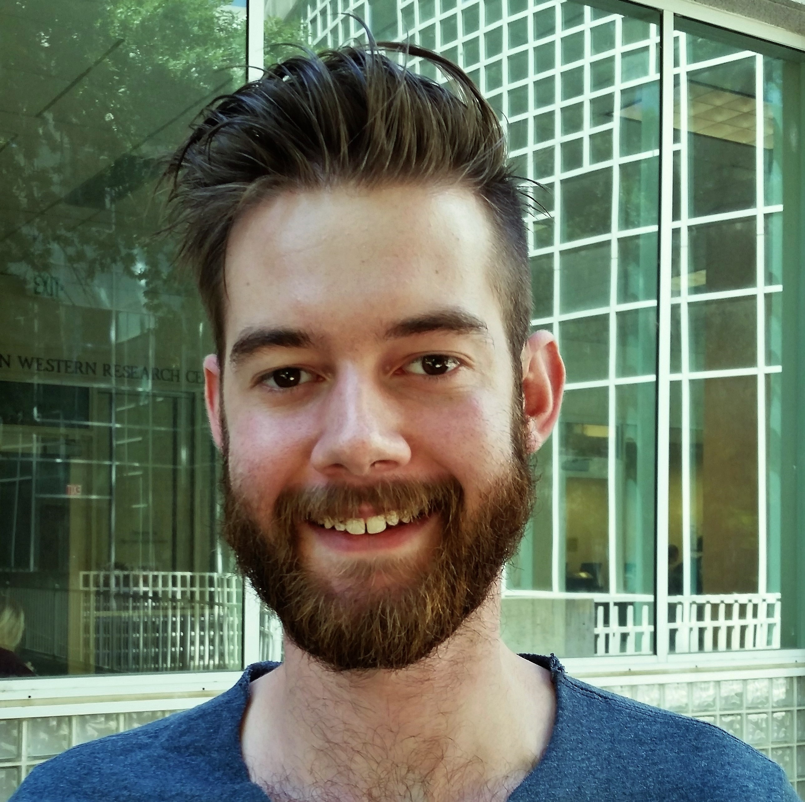</img>
<a href="mailto:aqvining@ucdavis.edu"></img></a>
<a href="https://github.com/aqvining">Alexander Vining</a>
graduate student, Animal Behavior  
<b> Inferring memory and cognition from animal movement pathways. </b>
Alexander studies the evolution of spatial memory and navigation in primates and other mammals. He uses a combination of agent based models, complexity analysis, and high resolution telemetry data to infer the cognitive processes driving animal movement. He is most experienced using R for geo-spatial and phylogenetic analyses, but also works in Python and C++.

</img>
<a href="mailto:kenwang@ucdavis.edu"></img></a>
<a href="https://www.linkedin.com/in/ken-wang-9766a3114/">Guangxing Ken Wang</a>
graduate student, Statistics  
<b> Developing and implementing methods for highly dimensional, functional data. </b>
Ken is developing new methods to work with infinitely dimensional functional data, and to make them implementable in common statistical computing languages. He wants to learn how to efficiently handle different data structures,  various languages, and the big picture of data science.

</img>
<a href="mailto:mrweeks@ucdavis.edu"></img></a>
<a href="http://geography.ucdavis.edu/people/madeline-weeks">Madeline Weeks</a>
graduate student, Geography  
<b> Geographies of fine flavor cacao and chocolate sourcing, farmer livelihoods, gender equity. </b>
Madeline uses mixed-methods including household surveys, network analysis, and qualitative interviews to cross-validate and synthesize different forms of data that can be applied to sustainability metrics and impact reporting. She hopes to bring her knowledge of small data into the big data world with an understanding of how to combine local with global measures.

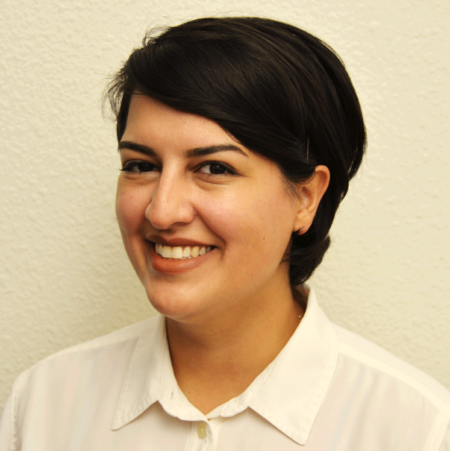</img>
<a href="mailto:elawhite@ucdavis.edu"></img></a>
<a href="https://twitter.com/wheatellie">Ellie White</a>
graduate student, Civil and Environmental Engineering / Center for Watershed Sciences  
<b> Predicting environmental data in un-gauged basins. </b>
Ellie's research aims to extract information from data for the better management of natural resources and the environment. Ellie works with large spatial and temporal datasets that are highly auto-correlated (e.g., precipitation, temperature, land cover, and hydrology). Her interests include: machine learning for predictive modeling, hydro-economic optimization modeling, and adaptation strategies to climate change.

</img>
<a href="mailto:ssyair@ucdavis.edu"></img></a>
<a href="https://cpb.ucdavis.edu">Sivan Yair</a>
graduate student, Population Biology  
<b> Population genomic theory and method development to characterize cases of introgression in natural systems. </b>
Sivan develops statistical models and analyzes genomic data to address questions in population genetics theory and methodology including the strength and timing of selection, history of admixture, and context in which beneficial alleles successfully introgress. Sivan primarily works with R and shell. Sivan is interested in learning more efficient coding techniques, computational statistics, data visualization, new programming languages, and data science applications in other fields.

