NOTE: DO NOT EDIT MANUALLY
title: Faculty Affiliates
<!-- DO NOT EDIT affiliates.md directly.  
     Edit this template and regenerate affiliates.md with
       cd content
  	   Rscript -e 'source("../funs.R") ; mkAffiliates_md()'
-->

title: Faculty Affiliates
<!-- DO NOT EDIT affiliates.md directly.  
     Edit this template and regenerate affiliates.md with
       cd content
  	   Rscript -e 'source("../funs.R") ; mkAffiliates_md()'
-->

title: Faculty Affiliates
<!-- DO NOT EDIT affiliates.md directly.  
     Edit this template and regenerate affiliates.md with
       cd content
  	   Rscript -e 'source("../funs.R") ; mkAffiliates_md()'
-->

</img>
<a href="mailto:nranderson@ucdavis.edu"></img></a>
<a href="http://www.ucdmc.ucdavis.edu/publish/providerbio/search/11634">Nick Anderson</a>
Director of Informatics Research and Robert D. Cardiff Professor of Informatics, UC Davis Medical Center, Sacramento  
<b>  </b>
Professor Anderson leads the development of the research informatics capabilities across the health system. His primary focus is on access to clinical data for research and secondary use, data policy and data sharing, and sustainable informatics infrastructure development. His research examines deidentified large-scale clinical data sharing including the processes, technologies and ethical impact of biomedicine data sharing for the advancement of “translational” science.

</img>
<a href="mailto:tdbeamish@ucdavis.edu"></img></a>
<a href="http://sociology.ucdavis.edu/people/tdbeamis">Tom Beamish</a>
Professor, Sociology  
<b>  </b>
Professor Beamish’s research and expertise include: risks, hazards, and the environment; community politics and social movements; institutions, organizations and the economy; and science, technology and innovation studies. His research interests also include developing analytic approaches to using social media data for studies of environmental and community politics.

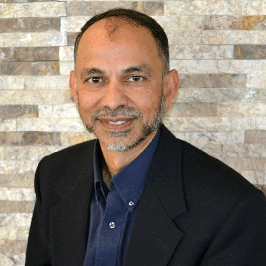</img>
<a href="mailto:hemantb@ucdavis.edu"></img></a>
<a href="https://gsm.ucdavis.edu/faculty/hemant-bhargava">Hemant Bhargava</a>
Professor, MBSA Program Chair, Jerome and Elise Suran Chair in Technology Management, Graduate School of Management  
<b>  </b>
Professor Bhargava is an expert in technology management and the information technology industry. He also studies the use of IT in clinical health care, and has previously worked on data-driven and analytical decision making in organizations.

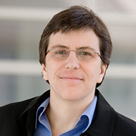</img>
<a href="mailto:bitler@ucdavis.edu"></img></a>
<a href="https://sites.google.com/site/mbitler/">Marianne Bitler</a>
Professor, Economics  
<b>  </b>
Professor Bitler's research focuses on the effects of government safety net programs on disadvantaged groups, economic demography, health economics, public economics, and the economics of education.

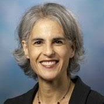</img>
<a href="mailto:gbloom@ucdavis.edu"></img></a>
<a href="http://english.ucdavis.edu/people/gbloom">Gina Bloom</a>
Professor, English  
<b>  </b>
Professor Bloom's research interests include early modern English literature, especially Shakespeare and drama, gender and feminist theory, theater history and performance, sound studies, digital arts/humanities, and education. She collaborates on the <a href="http://modlab.ucdavis.edu/">ModLab</a> Shakespearean video game project <a href="http://english.ucdavis.edu/playtheknave.org">Play the Knave</a>, on which she is leading a collaborative research project with the DSI.

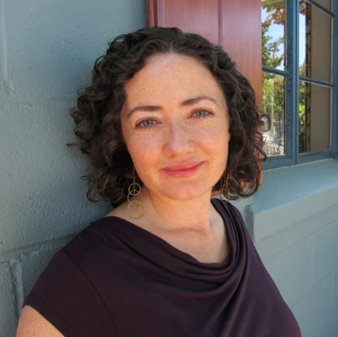</img>
<a href="mailto:aboydstun@ucdavis.edu"></img></a>
<a href="http://www.amber-boydstun.com/">Amber Boydstun</a>
Associate Professor, Political Science  
<b>  </b>
Professor Boydstun conducts research on media framing and public opinion data. She has a collaborative project with the DSI looking at patterns in media frames in newspapers throughout the USA over time. Her projects have involved text mining, machine learning, and interactive visualization for exploratory data analysis.

</img>
<a href="mailto:ctbrown@ucdavis.edu"></img></a>
<a href="https://biology.ucdavis.edu/people/c-titus-brown">Titus Brown</a>
Associate Professor, Veterinary Medicine  
<b>  </b>
The Brown lab focuses on genomic, transcriptomic, and metagenomic sequence analysis. The lab is the primary developer of the <a href="http://khmer.readthedocs.org/">khmer</a> software, for faster and more efficient sequence analysis of high-throughput sequencing data. They also run quite a bit of <a href="http://ivory.idyll.org/lab/">training in data-intensive biology</a>, and a weekly "meet and analyze data" drop-in office hours.

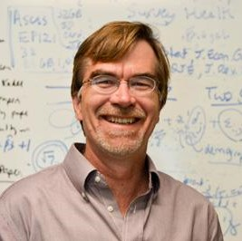</img>
<a href="mailto:accameron@ucdavis.edu"></img></a>
<a href="http://cameron.econ.ucdavis.edu/">Colin Cameron</a>
Professor of Economics, Economics  
<b>  </b>
Professor Cameron’s research speciality is economic theory and microeconmetrics for cross-section data, especially count data, with applications to labor and health economic data.

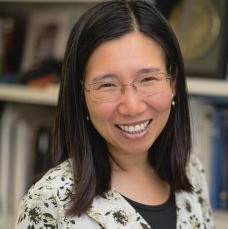</img>
<a href="mailto:chuah@ece.ucdavis.edu"></img></a>
<a href="http://faculty.engineering.ucdavis.edu/chuah/">Chen-nee Chuah</a>
Professor, Electrical & Computer Engineering  
<b>  </b>
Professor Chuah studies communications and computer networks, and wireless/mobie computing. Her research focuses on internet measurement and network management, data acquisition (e.g., sampling, streaming, online learning), data analytics (e.g., anomaly detection), routing & traffic engineering, and software defined networks. She is interested in collaborative, interdisciplinary research approaches applying data science to emerging societal-scale applications including massive online social platforms, intelligent transportation systems, and digital health. She teaches EEC274 (Internet Measurements, Modeling, and Analysis).

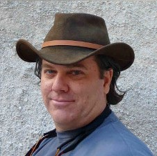</img>
<a href="mailto:crutchfield@ucdavis.edu"></img></a>
<a href="http://physics.ucdavis.edu/people/faculty/james-crutchfield">James Crutchfield</a>
Professor, Physics  
<b>  </b>
Professor Crutchfield's research focuses on nonlinear dynamics, condensed matter physics, physics of computation, evolutionary dynamics, pattern discovery, dynamics of learning, and distributed robotics. He is a faculty memeber of the <a href="http://csc.ucdavis.edu/Welcome.html">Complexity Science Center</a>. He teaches Physics 256A (Physics of Information) and Physics 256B (Physics of Computation).

</img>
<a href="mailto:pdodd@ucdavis.edu"></img></a>
<a href="http://research.ucdavis.edu/about-us/or-leadership/#avcirsi">Paul Dodd</a>
Associate Vice Chancellor for Interdisciplinary Research and Strategic Initiatives, Office of Research  
<b>  </b>
Dr. Dodd’s background is in nanoscale materials science and applied physics, and has worked at the interface of industry, academia for over 20 years. He administers the ten UC Davis Organized Research Units and is responsible for developing interdisciplinary research activities for the Davis campus including initiating, supporting and coordinating the development of new strategic research partnerships. You can read more about his background and the UC Davis interdisciplinary research and strategic initiatives, <a href="http://research.ucdavis.edu/about-us/or-leadership/#avcirsi">here</a>.

</img>
<a href="mailto:bndugger@ucdavis.edu"></img></a>
<a href="https://www.ucdmc.ucdavis.edu/pathology/our_team/faculty/duggerB.html">Brittany Dugger</a>
Assistant Professor, Pathology and Laboratory Medicine  
<b>  </b>
Dr. Dugger's research focus on understanding heterogeneity within neurodegenerative diseases and the interaction of peripheral changes to aging and neurodegenerative diseases. She is the neuropathology core leader at the UC Davis Alzheimer's Disease Center. Prior to arriving at UC Davis she served as the neuropathology core leader for academic and drug discovery groups within the Institute of Neurodegenerative Diseases at the University of California San Francisco. She is interested in how developments in AI can revolutionize healthcare, and how to train clinicians to best utilize and interface with these emerging technologies.

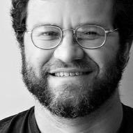</img>
<a href="mailto:jaeisen@ucdavis.edu"></img></a>
<a href="https://phylogenomics.me/">Jonathan Eisen</a>
Professor, Department of Evolution and Ecology, Genome Center, Center for Population Biology, Department of Medical Microbiology and Immunology, School of Medicine, Coastal and Marine Sciences Institute  
<b>  </b>
Professor Eisen studies the ecology, evolution and function of microbes and microbial communities, and develops phylogeny-driven computational tools to analyze genomic and metagenomic sequence data. He is interested in the integration between data sources, acquisition,  analysis, eithics and workflow management.

</img>
<a href="mailto:rwfaris@ucdavis.edu"></img></a>
<a href="http://sociology.ucdavis.edu/people/rwfaris">Robert Faris</a>
Associate Professor, Sociology  
<b>  </b>
Professor Faris uses social network analysis to determine why teens bully each other, drink and do drugs, and engage in dating violence.

</img>
<a href="mailto:eferrer@ucdavis.edu"></img></a>
<a href="http://psychology.ucdavis.edu/people/eferrer">Emilio Ferrer</a>
Professor, Psychology  
<b>  </b>
Professor Ferer is he is interested in how intra-individual dynamical information can be retained and used to explain inter-individual differences across a population. He is interested in methods deveopment and applications of of latent growth analysis and linear and nonlinear dynamical systems. In his Dynamics in Psychological Science Lab, he models dyadic interactions and multivariate processes associated wth reasoning and reading achievement from childhood to adolescence. Professor Ferrer is also a member of the Graduate Group in Biostatistics and an affiliate at the Center for Mind and Brain. He teaches psychology courses on statistics, longitudinal data analysis, and applied multivariate statistics.

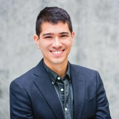</img>
<a href="mailto:rfinnigan@ucdavis.edu"></img></a>
<a href="http://www.ryanmfinnigan.com/">Ryan Finnigan</a>
Assistant Professor, Sociology  
<b>  </b>
Professor Finnigan's research examines how macro- and meso-level economic, demographic, and institutional changes influence poverty and inequality.

</img>
<a href="mailto:rlfong@ucdavis.edu"></img></a>
<a href="http://www.ucdmc.ucdavis.edu/publish/facultybio/search/faculty/1084">Ronald Fong</a>
Assistant Clinical Professor, UCD Medical Center, Family and Community Medicine  
<b>  </b>
Professor Fong is a family physician with a clinical interest in obesity and chronic kidney disease. He is working with the DSI on a collaborative project to dynamically predict patients' length of hosipital stays.

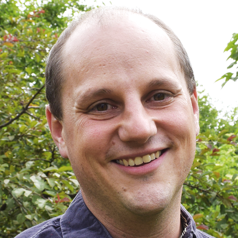</img>
<a href="mailto:dfox@ucdavis.edu"></img></a>
<a href="http://foxlab.ucdavis.edu/">Andrew Fox</a>
Assistant Professor, Psychology  
<b>  </b>
Professor Fox studies the neuroscience of social and emotional behavior in humans and non-human primates with a focus on emotional and social decision-making. He uses Python in his teaching and runs an informal Python Users Group through the DSI. He teaches PSC 290 (Introduction to scientific programming for psychology).

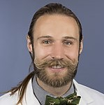</img>
<a href="mailto:jpgraff@ucdavis.edu"></img></a>
<a href="http://www.ucdmc.ucdavis.edu/publish/providerbio/pathology/22164">John Paul Graff</a>
Assistant Professor, Pathology and Laboratory Medicine  
<b>  </b>
Dr. Graff 's research focuses on hematopathology including lymphoma, leukemia, and non-neopastic hematologic processes. He is interested in machine learning applications for pathology, including acute leukemia and flow cytometry, and in developing programs and computational models to improve pathology workflows and data collection.

</img>
<a href="mailto:jrgriesemer@ucdavis.edu"></img></a>
<a href="https://jrgriesemerucdavis.wordpress.com/">James Griesemer</a>
Professor, Philosophy  
<b>  </b>
Professor Griesemer's primary interests are philosophical, historical, and social understanding of the biological sciences, especially evolutionary biology, genetics, developmental biology, ecology and systematics. He is also a member of the <a href="http://sts.ucdavis.edu/">Science and Technology Studies Program</a>.

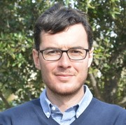</img>
<a href="mailto:jdherman@ucdavis.edu"></img></a>
<a href="https://herman.ucdavis.edu/">Jonathan Herman</a>
Assistant Professor, Civil & Environmental Engineering  
<b>  </b>
Professor Herman's research focuses on water resources planning and management. His research goal is to improve computational methods for simulation and optimization of water resources systems, including climate adaptation planning under uncertainty, multi-objective reservoir control, and parameter sensitivity in flood and drought prediction. He teaches ECI 273 (Water Resources Systems Engineering), which covers elements of web scraping, data cleaning and visualization with Python.

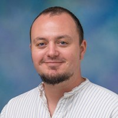</img>
<a href="mailto:jhibel@ucdavis.edu"></img></a>
<a href="https://jhibel.faculty.ucdavis.edu/">Jacob Hibel</a>
Associate Professor, Sociology  
<b>  </b>
Professor Hibel uses sociological and demographic approaches to study the sources and implications of educational stratification. His research focuses on: special education inequalities, immigration and educational inequality, school readiness and early educational stratification, and education expansion and social change in contemporary China. He is working with the DSI on a collaborative project to extract data from California Local Control and Accountability Plans (LCAPs), a state-wide reporting tool that seeks to improve student outcomes. He teaches SOC 106 (Intermediate Social Statistics) and SOC206 (Quantitative Data Analysis).

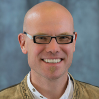</img>
<a href="mailto:hilbert@ucdavis.edu"></img></a>
<a href="http://www.martinhilbert.net">Martin Hilbert</a>
Associate Professor, Communication  
<b>  </b>
Professor Hilbert studies the role of information, communication, and knowledge in the development of complex social systems. He teaches CMN150V (Computational Social Science graduate course on data science).

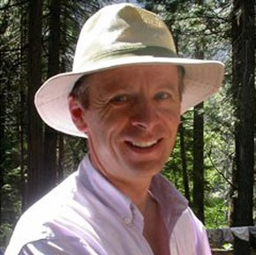</img>
<a href="mailto:rhijmans@ucdavis.edu"></img></a>
<a href="http://biogeo.ucdavis.edu/">Robert Hijmans</a>
Professor, Environmental Science & Policy  
<b>  </b>
Professor Hijmans studies agriculture, ecology and and human health. He is particularly interested in the role of agricultural development in Africa, and in the role of biodiversity in agriculture. He specializes in spatial data science, ecological modeling and geo-informatics, and teaches spatial data analysis and modeling courses including GEO 200CN ("Quantitative geography"), and ABT181N and ABT182. He is author of a number of R packages, including <a href="https://cran.r-project.org/web/packages/raster/">'raster'</a>, <a href="https://cran.r-project.org/web/packages/dismo/">'dismo'</a>, and <a href="https://cran.r-project.org/web/packages/geosphere/">'geosphere'</a>, and maintains the the <a href="worldclim.org">WorldClim</a>, and <a href="gadm.org">GADM</a> spatial databases.

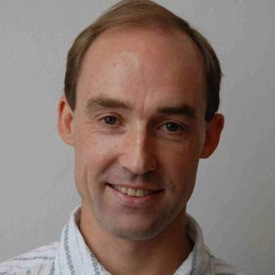</img>
<a href="mailto:maholyoak@ucdavis.edu"></img></a>
<a href="http://www.des.ucdavis.edu/faculty/holyoak/">Marcel Holyoak</a>
Professor, Environmental Science & Policy  
<b>  </b>
Professor Holyoak's research focuses on questions about the importance of spatial dynamics to populations and communities. Specifically, he is interested in metacommunities and the role of spatial dynamics, conservation of threatened animal species, the ecology of organismal movement, and metapopulation persistence. His work addresses theories that are central to conservation and the maintenance of biodiversity, and combines field, laboratory and theoretical components.

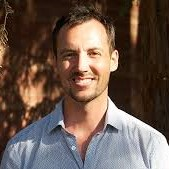</img>
<a href="mailto:bzhoulton@ucdavis.edu"></img></a>
<a href="https://www.bzhoulton.com/">Benjamin Houlton</a>
Chancellor's Fellow, Professor of Global Environmental Studies, and Director of the John Muir Institute for the Environment, John Muir Institute for the Environment  
<b>  </b>
Professor Houlton’s research interests include ecosystem processes, climate change and the growing risks of human alterations to the global carbon, nitrogen, phosphorous cycles for enhanced energy and food production. As Director of JMIE, Professor Houlton catalyzes research discovery across more than 300 faculty-experts from across UC Davis to devise innovative solutions to the environmental sustainability challenges of the 21st century.

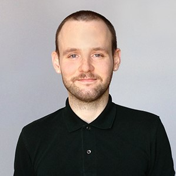</img>
<a href="mailto:rhubert@ucdavis.edu"></img></a>
<a href="http://www.ryanhubert.com/">Ryan Hubert</a>
Assistant Professor, Political Science  
<b>  </b>
Professor Hubert uses game theory, machine learning and text analysis to study U.S. political institutions, especially the federal courts. He is interested in how  the predictive power of machine learning can be leveraged for descriptive research.

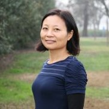</img>
<a href="mailto:yujin@ucdavis.edu"></img></a>
<a href="http://jin.ucdavis.edu/">Yufang Jin</a>
Associate Professor, Land, Air and Water Resources  
<b>  </b>
Professor Jin's uses remote sensing from satellite, airborne, and UAV/drone platforms to monitor ecosystem dynamics, crop conditions and yields, and to study the associtated drivers and feedbacks. She is interested in landscape and regional scale phenomena occuring in both natural and managed ecosystems ranging from croplands, rangelands, savannas, and forests. She contributes to sustainable agriculture and natural resource use by providing advanced geospatial tools and delivering observation-based information to resource managers and farmers.

</img>
<a href="mailto:ckjohnson@ucdavis.edu"></img></a>
<a href="http://www.vetmed.ucdavis.edu/faculty/results.cfm?fid=17867">Christine Kreuder Johnson</a>
Professor, Veterinary Medicine  
<b>  </b>
Professor Kreuder Johnson's research focuses on wildlife epidemiology, with special emphasis on wildlife population health and emerging infectious diseases with significance to public health and health security. Her lab is working on a collaborative project with the DSI to explore patterns in global zoonotic disease spillovers.

</img>
<a href="mailto:lhkellogg@ucdavis.edu"></img></a>
<a href="http://geology.ucdavis.edu/people/faculty/kellogg.php">Louise Kellogg</a>
Professor of Geophysics and Director of [Computational Infrastructure for Geodynamics](https://geodynamics.org/), Geology  
<b>  </b>
Professor Kellogg studies the dynamics of the solid Earth and similar planets, focusing on mantle convection and crustal deformation using computational models rooted in observation. She established the <a href="http://keckcaves.org/">W. M. Keck Center for Active Visualization in Earth Sciences (KeckCAVES)</a> where her research includes interactive visualization of data from natural disaster sites, reconstructing paleoocean flow, and using virtual reality and augmented reality for research and outreach.

</img>
<a href="mailto:pakoehl@ucdavis.edu"></img></a>
<a href="http://web.cs.ucdavis.edu/~koehl/">Patrice Koehl</a>
Professor of Computer Science and Founding Director of the Data Science Initiative, Computer Science  
<b>  </b>
Professor Koehl’s interests lay at the interface of physics, geometry and biology. His research focuses on computational algorithmic developments and management of complex biological data as well as the quantification of biological systems (morphometry) and the formation (morphogenesis) and evolution (morphodynamics) of of molecular shapes. His research group develops new statistical algorithms for clustering post-genomic data, and geometric methods for processing image data for high-throughput comparisons of 3D-images.

</img>
<a href="mailto:mkoeppe@math.ucdavis.edu"></img></a>
<a href="https://www.math.ucdavis.edu/~mkoeppe/">Matthias Köppe</a>
Professor, Mathematics  
<b>  </b>
Professor Köppe's research focuses on mathematical optimization (integer programming) and computational discrete mathematics. He teaches several courses on these topics, including MAT 168 (Optimization), MAT 258A (Numerical Optimization) and MAT 258B (Discrete and Mixed Integer Optimization). For more information on these and other classes (including some lecture recoredings), <a href="https://www.math.ucdavis.edu/~mkoeppe/#uni-lectures">see his website</a>.

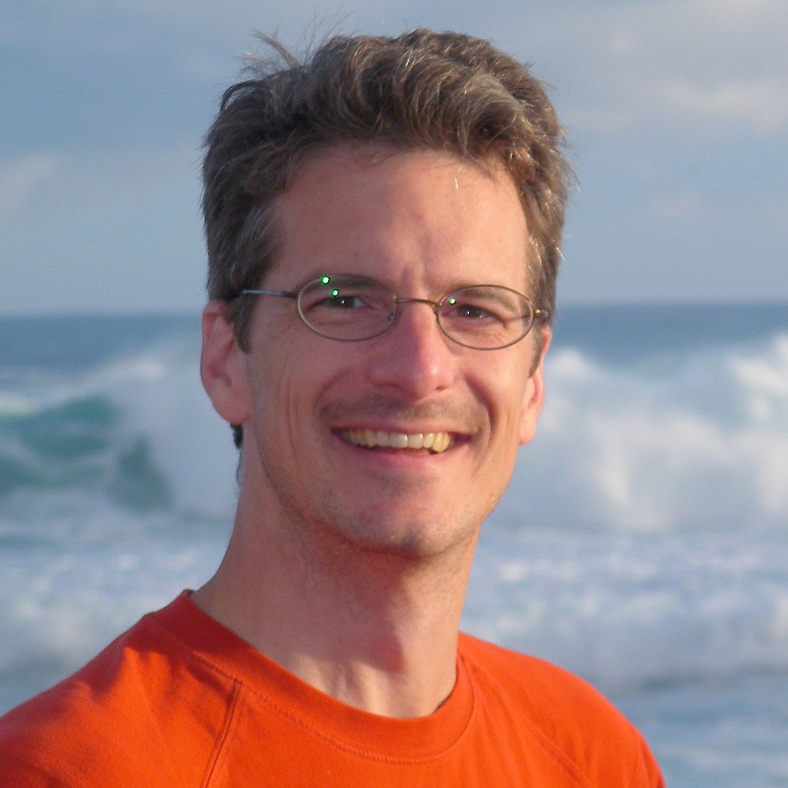</img>
<a href="mailto:amlatimer@ucdavis.edu"></img></a>
<a href="http://www.plantsciences.ucdavis.edu/faculty/latimer/people.htm">Andrew Latimer</a>
Associate Professor, Plant Sciences  
<b>  </b>
Professor Latimer studies plant ecological and evolutionary responses to environmental disturbance and variation. His core research interests include forest and grassland responses to climate change, fire and drought. He uses field and satellite data to model and predict environmental impacts at the trees and landscape level.

</img>
<a href="mailto:lenoir@ucdavis.edu"></img></a>
<a href="http://sts.ucdavis.edu/people/lenoir">Tim Lenoir</a>
Professor, Science & Technology Studies, and Cinema & Digital Media  
<b>  </b>
Professor Lenoir studies the history of biomedicine, particularly on areas related to the impact of of computer technologies such as bioinformatics, robotics and artificial intelligence on contemporary biomedicine. He is interested in how federal programs and university-industry collaborations stimulate innovation in science, technology and medicine.

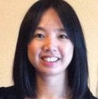</img>
<a href="mailto:sweliu@ucdavis.edu"></img></a>
<a href="https://siweiliu.weebly.com/index.html">Siwei Liu</a>
Assistant Professor, Human Development & Family Studies  
<b>  </b>
Professor Liu conducts research on statistical methods for analyzing intensive longitudinal data, in particular in the frameworks of multilevel modeling, structural equation modeling, time series analysis, and functional data analysis. Her research involves techniques for modeling synchrony and coregulatory processes in close relationships (e.g., parent-child, couples), and the applications of intensive longitudinal methods in health-related research (e.g., stress, physical activity, sleep). She has taught a course on Longitudinal Data Analysis in the Human Development Department.

</img>
<a href="mailto:fjloge@ucdavis.edu"></img></a>
<a href="https://faculty.engineering.ucdavis.edu/loge/">Frank Loge</a>
Professor, Civil & Environmental Engineering  
<b>  </b>
Professor Loge's research focuses on the water-energy nexus including water and energy efficiency in urban and agricultural systems, sustainable building design, water reuse, conservation based water rate design, and data analytics.

</img>
<a href="mailto:mnlubell@ucdavis.edu"></img></a>
<a href="http://www.des.ucdavis.edu/faculty/lubell/">Mark Lubell</a>
Professor, Environmental Science & Policy  
<b>  </b>
Professor Lubell studies cooperation problems and decision-making in environmental, agricultural, and public policy. His research topics include include water management, sustainable agriculture, adaptive decision-making, climate change policy, local government policy, transportation behavior, plant disease management, invasive species, and policy/social network analysis. In addition to field surveys he also uses simulations and behaivoral experiments to study cooperation.

</img>
<a href="mailto:ekmerchant@ucdavis.edu"></img></a>
<a href="http://www.emilyklancher.com">Emily Merchant</a>
Assistant Professor, Science & Technology Studies  
<b>  </b>
Professor Merchant is a historian of science, technology, and medicine. Her research combines methods of close and distant (algorithmic) reading of archival documents, oral history interviews, and published sources with approaches drawn from history, science and technology studies, the digital humanities, and the quantitative social sciences. She teaches an undergraduate course on Visualizing Society with Data, and a graduate leve course on using R for text analyses and mapping.

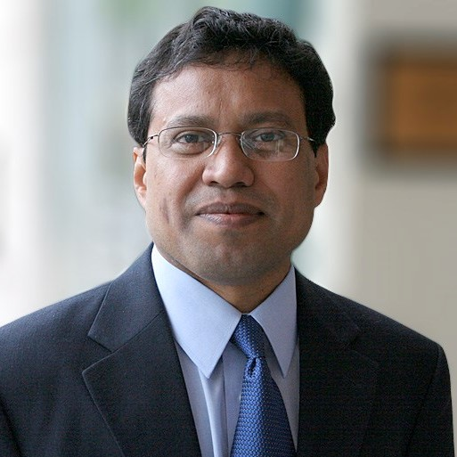</img>
<a href="mailto:pmohapatra@ucdavis.edu"></img></a>
<a href="https://faculty.engineering.ucdavis.edu/mohapatra/biography/">Prasant Mohapatra</a>
Professor of Computer Science, Dean of Graduate Studies and Vice-Provost of Graduate Education, Graduate Studies  
<b>  </b>
Professor Mohapatra’s research interests focus on wireless networks, mobile communications, cybersecurity and internet protocols. Dr. Mohapatra is the Editor-in-Chief of the IEEE Transactions on Mobile Computing, and he has published over 300 research papers in his field.

</img>
<a href="mailto:jkm@ucdavis.edu"></img></a>
<a href="http://www.moorepants.info">Jason K. Moore</a>
Faculty (LPSOE), Mechanical & Aerospace Engineering  
<b>  </b>
Jason K. Moore is an assistant teaching professor with teaching and research interests in multibody dynamics, biomechanics, and engineering education. He is very active in the Scientific Python community where he is a core developer of the SymPy and PyDy projects. He has mentored numerous Google Summer of Code students over the last decade and hosts the College of Engineering's JupyterHub for their computing courses. He is currently an editor for both The Journal of Open Source Education and The Journal of Open Engineering.

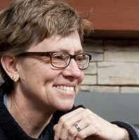</img>
<a href="mailto:dniemeier@ucdavis.edu"></img></a>
<a href="https://faculty.engineering.ucdavis.edu/dniemeier/biography/">Deb Niemeier</a>
Professor, Civil & Environmental Engineering, and School of Education  
<b>  </b>
Professor Niemeier's research focuses on integrating models for estimating mobile source emissions with transportation modeling. She is the PI on a NSF NRT grant on <a href="https://www.nsf.gov/awardsearch/showAward?AWD_ID=1545193">Data Science for the Built Environment</a>. Dr. Niemeier is an AAAS fellow and a member of the National Academy of Engineering. She has taught ECI 298: Introduction to Transportation Data and Analysis Using R.

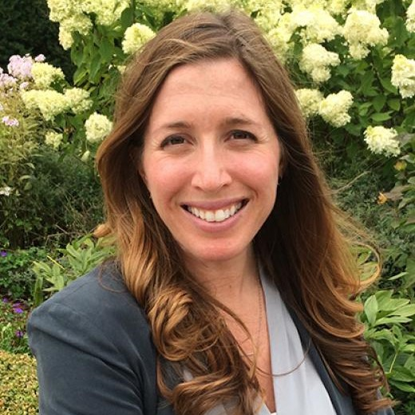</img>
<a href="mailto:patler@ucdavis.edu"></img></a>
<a href="https://caitlinpatler.com">Caitlin Patler</a>
Assistant Professor, Land, Air & Water Resources  
<b>  </b>
Dr. Patler's reserch focuses on migration, inequality, and socio-legal studies. She is currently conducting two longitudinal and mixed-methods research studies on: 1) immigration detention, deportation, and the intersections of immigration and criminal law, and 2) the Deferred Action for Childhood Arrivals (DACA) program.

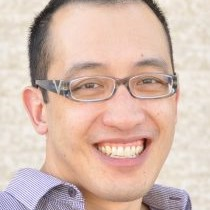</img>
<a href="mailto:gquon@ucdavis.edu"></img></a>
<a href="https://qlab.faculty.ucdavis.edu/">Gerald Quon</a>
Assistant Professor, Molecular and Cellular Biology  
<b>  </b>
Dr. Quon's research interests include using both classic machine learning and deep neural networks to build quantitative models of the cell and address a wide range of questions, including how genetics influences a person's risk of complex diseases and how cells can be reprogrammed from one type to another for regenerative medicine.

</img>
<a href="mailto:abrezaee@ucdavis.edu"></img></a>
<a href="https://armanrezaee.github.io/">Arman Rezaee</a>
Assistant Professor, Economics  
<b>  </b>
NA

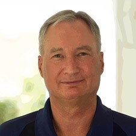</img>
<a href="mailto:jbrundle@ucdavis.edu"></img></a>
<a href="http://rundle.physics.ucdavis.edu/">John Rundle</a>
Professor, Physics, Earth and Planetary Sciences  
<b>  </b>
Professor Rundle's research focuses on developing the theoretical and computational methods needed to understand classes of driven, non-equilibrium threshold systems. These primarily include networks of earthquake faults, but also can be applied to neural networks, superconductors and semiconductors, the World Wide Web, and political, social and ecological systems. He is particularly interested in computational tool development to simulate these high-dimensional complex systems within the context of web-based, HPC and other types of parallel, SMP machines. Computational simulations represent a major tool and a major focus of his lab's research.

</img>
<a href="mailto:saito@math.ucdavis.edu"></img></a>
<a href="https://www.math.ucdavis.edu/~saito/">Naoki Saito</a>
Professor, Mathematics  
<b>  </b>
Professor Saito's research interests include topics including applied and computational harmonic analysis, statistical signal/image processing and analysis, feature extraction, pattern classification and recognition, and data compression. He teaches MAT 167 (Applied Linear Algebra), MAT 271 (Applied & Computational Harmonic Analysis), and MAT 280 (topics including: Harmonic Analysis on Graphs & Networks; Laplacian Eigenfunctions: Theory, Applications, and Computations)

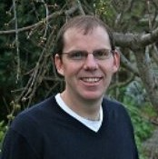</img>
<a href="mailto:jsanchirico@ucdavis.edu"></img></a>
<a href="http://www.des.ucdavis.edu/faculty/Sanchirico/Index.htm">Jim Sanchirico</a>
Professor, Environmental Science & Policy  
<b>  </b>
Professor Sanchirico applies empirical and theoretical quantitative methods to study the design and evaluation of policy instruments for the conservation of natural resources.  His main research interests include the economic analysis of policy design, implementation, and evaluation for marine and terrestrial species conservation, and the development of economic-ecological models for forecasting the effects of resource management policies.

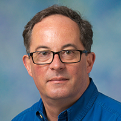</img>
<a href="mailto:jtscott@ucdavis.edu"></img></a>
<a href="http://ps.ucdavis.edu/people/jarrett">John Scott</a>
Professor, Political Science  
<b>  </b>
Professor Scott's research focuses on the history of political philosophy, with a specialization in early modern political thought. He is also interested in experimental approaches to distributive justice, and related areas such as perceptions of legitimacy of Supreme Court decisions.

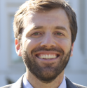</img>
<a href="mailto:tascott@ucdavis.edu"></img></a>
<a href="https://desp.ucdavis.edu/people/tyler-scott">Tyler Scott</a>
Assistant Professor, Environmental Science & Policy  
<b>  </b>
Dr. Scott’s research focuses on institutional design and management strategies for improving environmental governance in complex institutional settings. A primary component of this work involves the use of inferential network analysis methods for understanding network governance processes and stakeholder coordination. Scott also uses computational methods such as automated text analysis to generate novel data from procedural documents and agent-based modeling to simulate policy system behavior.

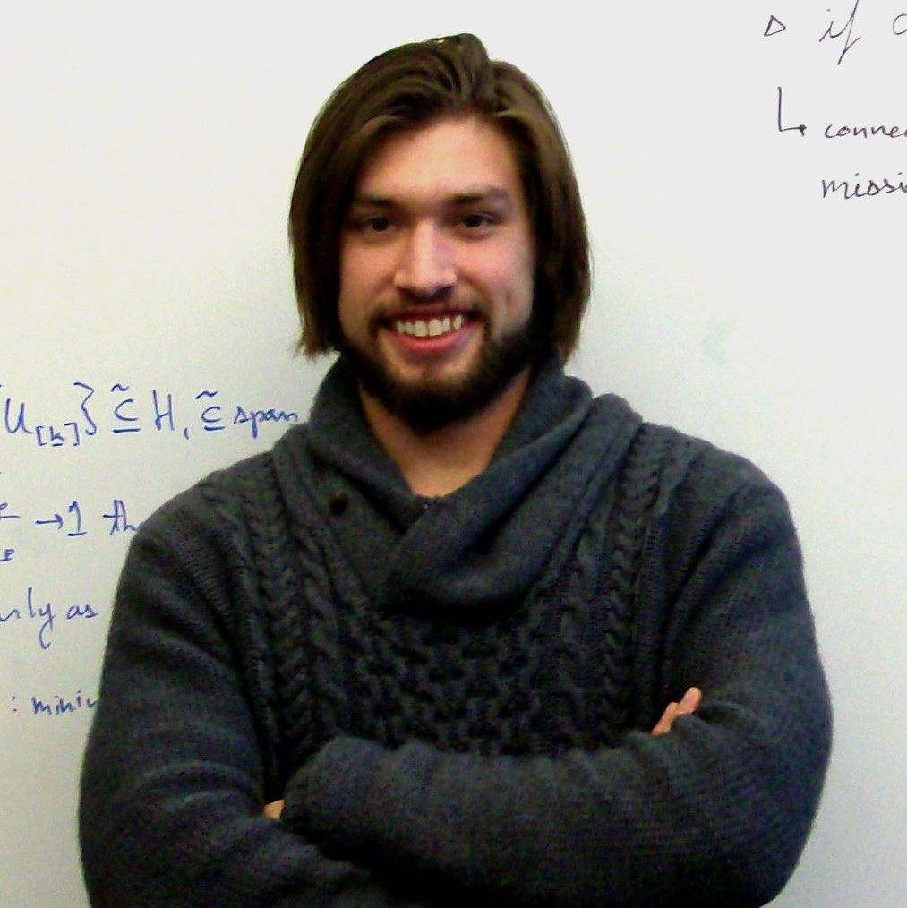</img>
<a href="mailto:jsharpna@ucdavis.edu"></img></a>
<a href="https://jsharpna.github.io/">James Sharpnack</a>
Assistant Professor, Statistics  
<b>  </b>
Professor Sharpnack develops and studies computationally efficient statistical methodology for understanding complex phenomena in large datasets. He holds a PhD  in Machine Learning and Statistics from Carnegie Mellon University. Courses he teaches include STA 141B (Data & Web Technologies for Data Analysis), STA 208 (Statistical Machine Learning), and STA 131A (Introduction to Probability Theory).

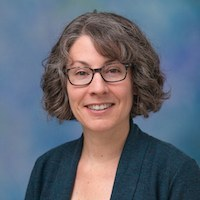</img>
<a href="mailto:kashauman@ucdavis.edu"></img></a>
<a href="http://sociology.ucdavis.edu/people/kashauma">Kimberlee Shauman</a>
Professor, Sociology  
<b>  </b>
Professor Shauman's research focuses on social stratification, social demography, and family, kinship and gender. She is leading a collaborative project with the DSI to explore biases in UC hiring practices. She teaches quantitative methods classes in the Sociology Department.

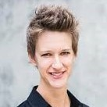</img>
<a href="mailto:chmsmith@ucdavis.edu"></img></a>
<a href="https://chrismsmithsociology.wordpress.com">Chris Smith</a>
Assistant Professor, Sociology  
<b>  </b>
Professor Smith studies inequality in crime, criminal relationships, and criminal organizations. Her research specializations also include feminist criminology, historical research methods, police violence, sociology of gender, urban sociology, and social network analysis. She has taught SOC 298 (Social Network Analysis for Social Scientists).

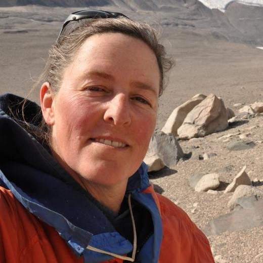</img>
<a href="mailto:dysumner@ucdavis.edu"></img></a>
<a href="https://geology.ucdavis.edu/people/faculty/sumner">Dawn Sumner</a>
Professor, Earth and Planetary Sciences  
<b>  </b>
Professor Sumner's research focuses on reconstructing ancient environments on early Earth and Mars and the early evolution of bacteria, including the origin of oxygenic photosynthesis. Her group studies everything from the environmental settings, geochemistry and morphology of Archean microbialites to the morphology, climate response, and genomics of modern microbial communities growing in ice-covered Antarctic lakes to the stratigraphy and geochemistry of sedimentary rocks on Mars. Sumner is a member of NASA’s Mars Science Laboratory, helping the rover Curiosity explore ancient environments in Gale Crater on Mars.

</img>
<a href="mailto:msyed@ucdavis.edu"></img></a>
<a href="http://mairajsyed.academia.edu/">Mairaj Syed</a>
Associate Professor, Religious Studies  
<b>  </b>
Professor Syed's research explores the history of Islamic legal and ethical thought, particularly areas dealing with public law, family law, and politics. He is also interested in the development of hadith literature and the social network that transmitted and preserved it in the first 250 years of Islamic history. He led a collaborative project with the DSI focused on accurate dating of hadiths. He has taught RST 130 (Hadith, Social Networks, and Computational Analyses).

</img>
<a href="mailto:tyson@physics.ucadvis.edu"></img></a>
<a href="http://tyson.ucdavis.edu/">Tony Tyson</a>
Distinguished Professor, Physics  
<b>  </b>
Professor Tyson is an experimental physicist with research in cosmology including dark matter distribution, gravitational lens effects, cosmic shear, the nature of dark energy, and instrumentation for optical astronomy. He pioneered the field of weak gravitational lensing, and dark energy was discovered using one of his wide field CCD cameras. Prior to coming to UC Davis he worked in the physics division at Bell Labs.

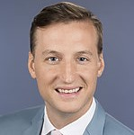</img>
<a href="mailto:rawray@ucdavis.edu"></img></a>
<a href="http://www.ucdmc.ucdavis.edu/publish/providerbio/cancer/22157">Rick Wray</a>
Assistant Professor, Radiology  
<b>  </b>
Dr. Wray is a molecular imaging specialist and nuclear medicine physician. His research focuses on machine learning and radiomics in oncologic molecular imaging. Utilizing novel dynamic PET/CT quantitative imaging features and biomarkers, he is creating imaging databases for use with modern ML/AI technologies to improve patient outcomes.

</img>
<a href="mailto:jdyoung@ucdavis.edu"></img></a>
<a href="https://www.jiayiyoung.info/">Jiayi Young</a>
Assistant Professor, Design  
<b>  </b>
She teaches DES37 (Coding for Designers), which includes data visualization and generative design.

</img>
<a href="mailto:joyu@ucdavis.edu"></img></a>
<a href="http://www.cs.cmu.edu/~zhouyu/">Zhou Yu 俞舟</a>
Assistant Professor, Computer Science  
<b>  </b>
Professor Yu designs algorithms for real-time intelligent interactive systems that coordinate with user actions that are beyond spoken languages, including non-verbal behaviors to achieve effective and natural communications. In particular, her research focuses on ptimizing human-machine communication via studies of multimodal sensing and analysis, speech and natural language processing, machine learning and human-computer interaction. She teaches special topics in AI courses through the Departmnet of Computer Science.

